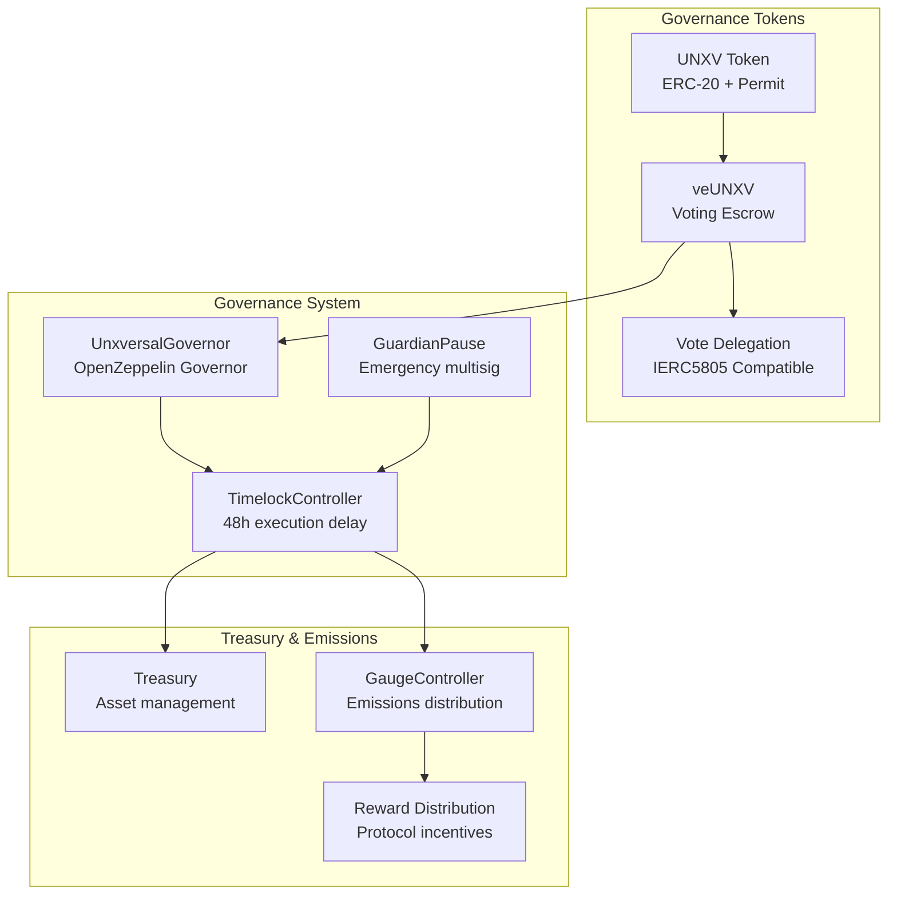
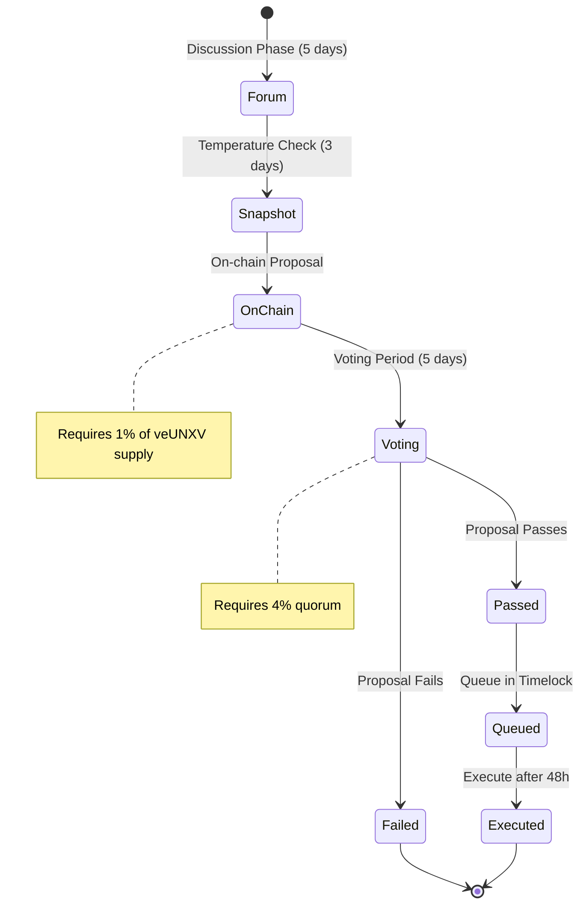
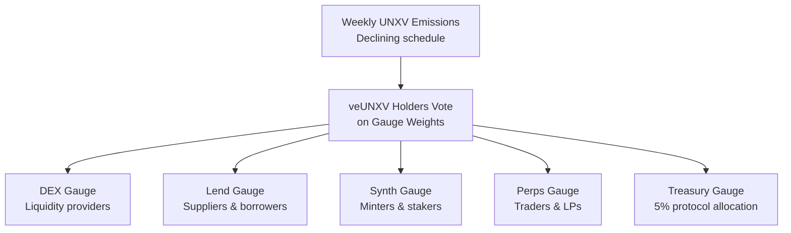
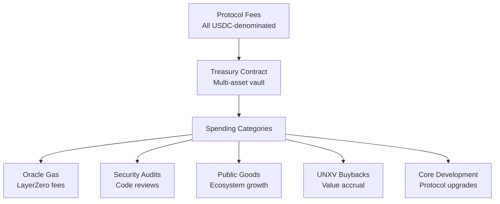
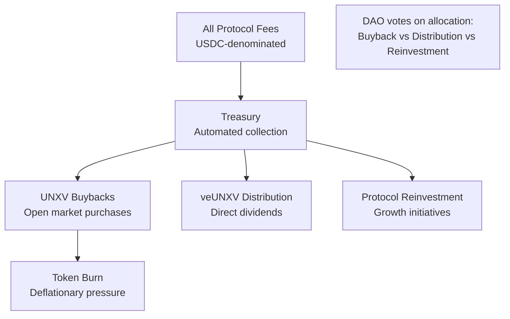

# Unxversal DAO - Governance Overview

## Introduction

The Unxversal DAO governs the entire protocol suite through a **vote-escrowed governance system** using **UNXV tokens**. The DAO controls protocol parameters, treasury management, and emissions distribution via a **gauge-based system** with **48-hour timelock security**.

## Core Architecture



## UNXV Tokenomics

### Token Distribution

```ascii
UNXV Token Allocation (1 Billion Total):

┌─────────────────────────────────────────────────────────────┐
│ Founders & Team: 35% (350M)                               │
│ ████████████████████████████████████                       │
│ 4-year linear vest, 1-year cliff                           │
└─────────────────────────────────────────────────────────────┘

┌─────────────────────────────────────────────────────────────┐
│ Community Incentives: 35% (350M)                          │
│ ████████████████████████████████████                       │
│ 6-year emissions, declining schedule                       │
└─────────────────────────────────────────────────────────────┘

┌──────────────────────────┐
│ Treasury: 15% (150M)     │
│ ████████████████         │
│ Immediate unlock         │
└──────────────────────────┘

┌─────────────────────┐
│ Ecosystem: 8% (80M) │
│ ████████████        │
│ 4yr vest, 6mo cliff │
└─────────────────────┘

┌──────────────┐
│ Liquidity    │
│ 5% (50M)     │
│ ████████     │
│ POL locked   │
└──────────────┘

┌────────────┐
│ Airdrop    │
│ 2% (20M)   │
│ ████       │
│ 12mo claim │
└────────────┘
```

### Emissions Schedule

```ascii
Community Incentives Release (350M over 6 years):

Year 1: 80M tokens  (22.9%)
Year 2: 60M tokens  (17.1%) 
Year 3: 45M tokens  (12.9%)
Year 4: 35M tokens  (10.0%)
Year 5: 25M tokens  (7.1%)
Year 6: 105M tokens (30.0%)

Declining factor: 1.33x per year for first 4 years
Final 2 years: Gradual release of remaining tokens
```

## Voting Escrow System (veUNXV)

### Lock Mechanics

```solidity
// Lock UNXV for 1-4 years to get veUNXV voting power
function createLock(uint256 value, uint256 unlockTime) external {
    require(value > 0, "Cannot lock 0");
    require(unlockTime > block.timestamp + MIN_LOCK_TIME, "Lock too short");
    require(unlockTime <= block.timestamp + MAXTIME, "Lock too long");
    
    // Transfer UNXV tokens
    unxvToken.safeTransferFrom(msg.sender, address(this), value);
    
    // Create lock position
    locked[msg.sender] = LockedBalance({
        amount: int128(uint128(value)),
        end: unlockTime
    });
    
    // Update voting power
    _updateVotingPower(msg.sender, locked[msg.sender]);
}
```

### Voting Power Calculation

```ascii
Voting Power Formula:

veUNXV = UNXV_locked × (lock_time_remaining / max_lock_time)

Examples:
• 1000 UNXV locked for 4 years = 1000 veUNXV initially
• 1000 UNXV locked for 2 years = 500 veUNXV initially  
• 1000 UNXV locked for 1 year = 250 veUNXV initially

Linear Decay:
• Voting power decreases linearly until unlock
• Must re-lock to maintain voting power
• Can extend lock time to increase power
```

## Governance Process

### Proposal Lifecycle



### Governance Parameters

```ascii
Governance Configuration:
┌─────────────────────────────────────────────────────────────┐
│ Proposal Threshold: 1% of circulating veUNXV              │
│ Quorum Requirement: 4% of circulating veUNXV              │
│ Voting Period: 5 days (43,200 blocks)                     │
│ Voting Delay: 1 day (8,640 blocks)                        │
│ Timelock Delay: 48 hours minimum                          │
│                                                             │
│ Guardian Powers (Emergency Only):                           │
│ • Pause protocol contracts (7 days max)                   │
│ • Cancel malicious proposals                               │
│ • Emergency parameter adjustments                          │
│                                                             │
│ Guardian Revocation: After Year 1, DAO can revoke         │
└─────────────────────────────────────────────────────────────┘
```

## Gauge System

### Emissions Distribution



### Gauge Weight Voting

```solidity
function voteForGaugeWeights(address gauge, uint256 weight) external {
    require(gauges[gauge].isActive, "Gauge not active");
    require(block.timestamp >= lastUserVote[msg.sender] + WEEK, "Can only vote once per week");
    
    // Get user's voting power
    uint256 votingPower = veUNXV.getVotes(msg.sender);
    require(votingPower > 0, "No voting power");
    
    // Remove old vote
    uint256 oldWeight = voteUserPower[msg.sender][gauge];
    voteUserTotal[msg.sender] -= oldWeight;
    
    // Add new vote
    voteUserPower[msg.sender][gauge] = weight;
    voteUserTotal[msg.sender] += weight;
    require(voteUserTotal[msg.sender] <= votingPower, "Used too much power");
    
    // Update gauge weight
    gauges[gauge].weight = gauges[gauge].weight + weight - oldWeight;
    totalWeight = totalWeight + weight - oldWeight;
    
    lastUserVote[msg.sender] = block.timestamp;
    emit VoteForGauge(msg.sender, gauge, weight);
}
```

## Treasury Management

### Asset Management



### Treasury Operations

```ascii
Treasury Spending Authorization:
┌─────────────────────────────────────────────────────────────┐
│ Automatic (No Vote Required):                              │
│ • Oracle gas payments                                      │
│ • Insurance fund top-ups                                   │
│ • Emergency security responses                             │
│                                                             │
│ Small Spending (<$25K):                                    │
│ • Working group budgets                                    │
│ • Routine operational expenses                             │
│ • Quick grants program                                     │
│                                                             │
│ Large Spending (>$100K):                                   │
│ • Major partnerships                                       │
│ • Large development initiatives                            │
│ • Significant protocol changes                             │
│ • Requires full governance process                         │
└─────────────────────────────────────────────────────────────┘
```

## Working Groups

### SubDAO Structure

```ascii
Working Groups (SubDAOs):
┌─────────────────────────────────────────────────────────────┐
│ Risk & Parameters WG:                                      │
│ • Monitor protocol risk metrics                           │
│ • Propose collateral factor changes                       │
│ • Quarterly budget: $50K                                  │
│                                                             │
│ Engineering WG:                                             │
│ • Core protocol development                                │
│ • Security audit coordination                              │
│ • Quarterly budget: $200K                                 │
│                                                             │
│ Growth & BD WG:                                            │
│ • Partnership development                                  │
│ • Marketing and community                                  │
│ • Quarterly budget: $100K                                 │
│                                                             │
│ Grants WG:                                                 │
│ • Developer grants (<$25K each)                           │
│ • Ecosystem development                                    │
│ • Quarterly budget: $150K                                 │
└─────────────────────────────────────────────────────────────┘
```

## Security & Emergency Procedures

### Guardian System

```solidity
contract GuardianPause {
    address[5] public guardians;
    uint256 public constant REQUIRED_SIGNATURES = 3;
    mapping(address => bool) public pausedContracts;
    
    function emergencyPause(address contract_) external {
        require(_isGuardian(msg.sender), "Not guardian");
        require(!pausedContracts[contract_], "Already paused");
        
        pausedContracts[contract_] = true;
        IPausable(contract_).pause();
        
        emit EmergencyPause(contract_, msg.sender, block.timestamp);
    }
    
    function unpause(address contract_) external onlyTimelock {
        require(pausedContracts[contract_], "Not paused");
        
        pausedContracts[contract_] = false;
        IPausable(contract_).unpause();
        
        emit EmergencyUnpause(contract_, block.timestamp);
    }
}
```

### Emergency Response Process

```ascii
Emergency Response Protocol:
┌─────────────────────────────────────────────────────────────┐
│ Level 1: Minor Issues                                      │
│ • Working group can address                                │
│ • No vote required                                         │
│ • Report to community                                      │
│                                                             │
│ Level 2: Moderate Issues                                   │
│ • Guardian pause (3/5 multisig)                           │
│ • Emergency governance vote                                │
│ • 24h timelock bypass allowed                             │
│                                                             │
│ Level 3: Critical Issues                                   │
│ • Immediate protocol pause                                 │
│ • All guardians alerted                                    │
│ • Emergency DAO session                                    │
│ • Full audit before resumption                            │
└─────────────────────────────────────────────────────────────┘
```

## Revenue Model & Value Accrual

### Fee Flow to UNXV Holders



### Value Accrual Mechanisms

```ascii
UNXV Value Drivers:
┌─────────────────────────────────────────────────────────────┐
│ Direct Value Accrual:                                      │
│ • Protocol fee buybacks                                    │
│ • veUNXV dividend distributions                           │
│ • Governance rights over treasury                          │
│                                                             │
│ Utility Value:                                              │
│ • Trading fee discounts                                    │
│ • Gauge weight voting power                                │
│ • Priority access to new features                          │
│                                                             │
│ Deflationary Mechanisms:                                    │
│ • Token burns from buybacks                                │
│ • Permanent lock options                                   │
│ • Emissions decline over time                              │
└─────────────────────────────────────────────────────────────┘
```

This governance system provides decentralized control over the entire Unxversal protocol while maintaining security through timelocks, guardian oversight, and progressive decentralization over time. 