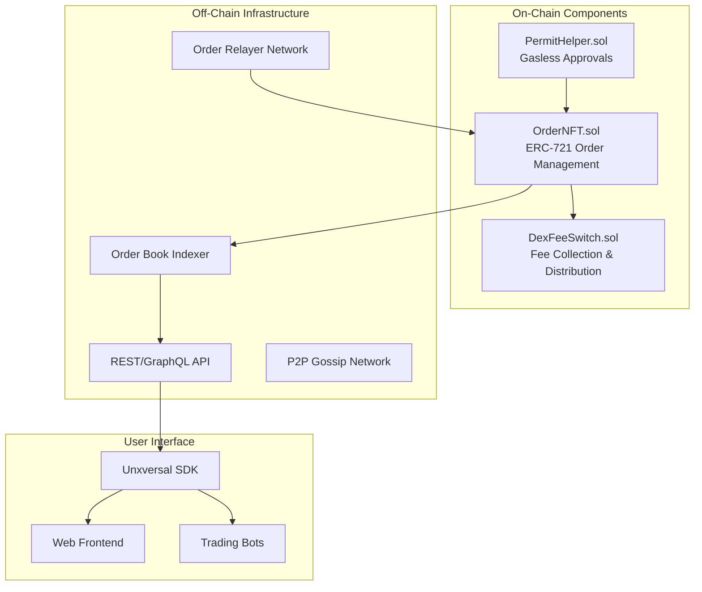
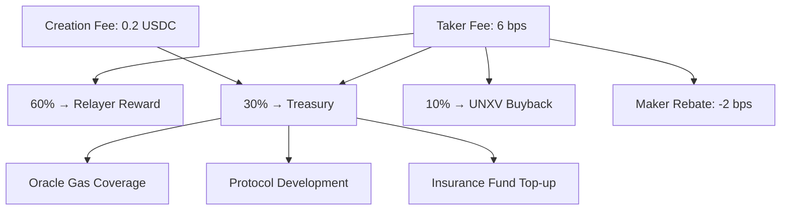
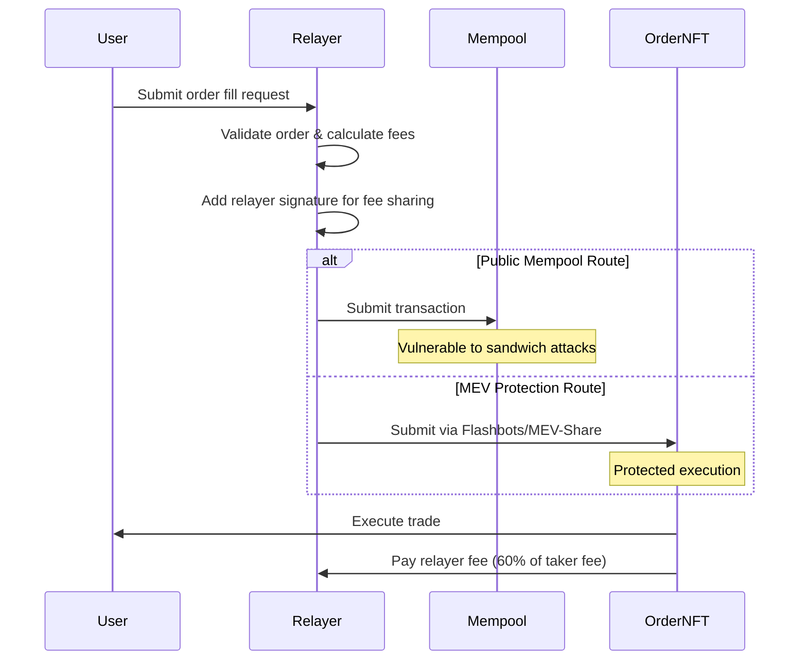
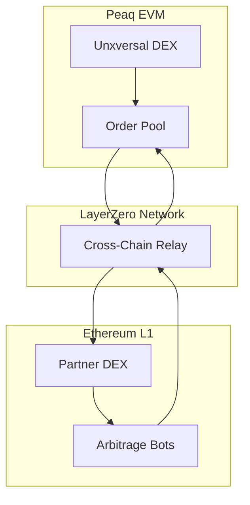

# Unxversal DEX Protocol - Technical Overview

## Introduction

The Unxversal DEX is an order-book based decentralized exchange that uses **NFT-encoded orders** for on-chain settlement with off-chain discovery. Unlike traditional AMMs, it provides **limit order functionality**, **price-time priority**, and **capital efficiency** without requiring liquidity pools.

## Architecture

### Core Components



## OrderNFT Contract

### Order Structure

```solidity
struct Order {
    address maker;              // Order creator
    address sellToken;          // Token being sold
    address buyToken;           // Token being bought
    uint256 sellAmount;         // Amount of sellToken (with decimals)
    uint256 buyAmount;          // Amount of buyToken desired
    uint256 price1e18;          // Price in 1e18 precision (buyToken/sellToken)
    uint64 expiry;             // Expiration timestamp
    uint256 amountRemaining;    // Unfilled sellToken amount
    OrderType orderType;        // MARKET, LIMIT, TWAP
    uint8 sellDecimals;        // Decimals of sell token (for gas optimization)
    uint24 feeBps;             // Custom fee in basis points
    bool isActive;             // Order status
}

enum OrderType {
    MARKET,     // Immediate execution at market price
    LIMIT,      // Execute only at specified price or better
    TWAP        // Time-weighted average price execution
}
```

### Key Functions

#### Creating Orders
```solidity
function createOrder(
    address sellToken,
    address buyToken,
    uint256 sellAmount,
    uint256 buyAmount,
    uint64 expiry,
    OrderType orderType,
    bytes calldata permitData  // Optional permit signature
) external returns (uint256 tokenId);
```

**Process:**
1. Validate token pair and amounts
2. Handle permit signature if provided (gasless approval)
3. Transfer sellToken from maker to contract
4. Mint NFT with order data
5. Emit `OrderCreated` event for indexers
6. Collect creation fee (0.2 USDC) for spam prevention

#### Filling Orders
```solidity
function fillOrders(
    uint256[] calldata orderIds,
    uint256[] calldata fillAmounts,
    uint256 deadline,
    bytes calldata relayerData
) external;
```

**Process:**
1. Validate orders are active and not expired
2. Check price-time priority (enforced off-chain, validated on-chain)
3. Calculate maker/taker fees
4. Execute token transfers atomically
5. Update order remaining amounts
6. Distribute fees via FeeSwitch
7. Emit `OrderFilled` events

#### TWAP Orders
```solidity
function executeTWAPOrder(
    uint256 orderId,
    uint256 executeAmount,
    uint256 currentPrice,
    bytes calldata priceProof
) external;
```

**TWAP Algorithm:**
- Orders execute in chunks over time
- Price validation against oracle/recent trades
- Time-weighted execution prevents manipulation
- Higher fees (8 bps) to compensate for complexity

### Gas Optimization Features

```ascii
Gas Optimizations:
┌─────────────────────────────────────────────────────────┐
│ • Packed structs in single storage slots               │
│ • Batch order processing (up to 10 orders per tx)      │
│ • Native ETH support (no WETH wrapping required)       │
│ • Permit2 integration for gasless approvals            │
│ • Efficient price calculations (fixed-point math)      │
│ • Storage cleanup on order completion                  │
└─────────────────────────────────────────────────────────┘

Typical Gas Costs:
• Create Order: ~85,000 gas
• Fill Single Order: ~35,000 gas  
• Fill Batch (5 orders): ~120,000 gas
• Cancel Order: ~25,000 gas
```

## Fee Structure

### Fee Tiers & Discounts

```ascii
Base Fee Schedule:
┌─────────────┬──────────────┬─────────────┬─────────────┐
│ Order Type  │ Maker Fee    │ Taker Fee   │ Min Size    │
├─────────────┼──────────────┼─────────────┼─────────────┤
│ Market      │ -2 bps       │ 6 bps       │ $10         │
│ Limit       │ -2 bps       │ 6 bps       │ $10         │
│ TWAP        │ 0 bps        │ 8 bps       │ $100        │
│ Large Block │ -5 bps       │ 4 bps       │ $10,000     │
└─────────────┴──────────────┴─────────────┴─────────────┘

Volume-Based Discounts (30-day trailing):
Tier 1: $0 - $100K      → 0% discount
Tier 2: $100K - $1M     → 20% discount
Tier 3: $1M - $10M      → 40% discount  
Tier 4: $10M+           → 60% discount

UNXV Staking Discounts:
• 1,000+ UNXV staked    → Additional 10% off all fees
• 10,000+ UNXV staked   → Additional 20% off all fees
• 100,000+ UNXV staked  → Additional 30% off all fees
```

### Fee Distribution



## Off-Chain Infrastructure

### Order Book Indexer

```typescript
// Indexer Architecture
interface OrderBookIndexer {
    // Real-time order tracking
    subscribeToOrders(callback: (order: Order) => void): void;
    
    // Order book maintenance
    getOrderBook(pair: string): OrderBook;
    getBestOrders(pair: string, side: 'buy' | 'sell', limit: number): Order[];
    
    // Historical data
    getTradeHistory(pair: string, from: Date, to: Date): Trade[];
    getVolumeStats(pair: string, period: string): VolumeStats;
}

interface OrderBook {
    bids: PriceLevel[];  // Buy orders
    asks: PriceLevel[];  // Sell orders
    spread: number;
    lastTradePrice: number;
    volume24h: number;
}
```

### Price-Time Priority

```ascii
Order Matching Algorithm:

1. Price Priority:
   ┌─────────────────────────────────────────┐
   │ Best bid: $100.00 (Order #1234)        │
   │ Next bid: $99.95  (Order #1235)        │  
   │ Next bid: $99.90  (Order #1236)        │
   └─────────────────────────────────────────┘

2. Time Priority (same price):
   ┌─────────────────────────────────────────┐
   │ $100.00 @ 14:30:00 (Order #1234) ← First│
   │ $100.00 @ 14:30:05 (Order #1237)       │
   │ $100.00 @ 14:30:12 (Order #1238)       │
   └─────────────────────────────────────────┘

3. Execution:
   Incoming sell order for $99.95 matches:
   • Order #1234 first (best price + time)
   • Then #1237 if size remaining
   • etc.
```

### MEV Protection



## Integration Examples

### Creating a Market Order

```solidity
// 1. Approve tokens (or use permit)
IERC20(sellToken).approve(orderNFT, sellAmount);

// 2. Create market order
uint256 orderId = orderNFT.createOrder(
    USDC,                    // sellToken  
    WETH,                    // buyToken
    1000 * 1e6,             // sellAmount (1000 USDC)
    333 * 1e15,             // buyAmount (0.333 ETH, ~$3000 price)
    block.timestamp + 300,   // expiry (5 minutes)
    OrderType.MARKET,        // orderType
    ""                      // no permit data
);

// 3. Order automatically indexed and matched
```

### SDK Integration

```typescript
import { UnxversalSDK } from '@unxversal/sdk';

const sdk = new UnxversalSDK({
    network: 'peaq-mainnet',
    privateKey: process.env.PRIVATE_KEY,
    rpcUrl: 'https://peaq.api.onfinality.io/public'
});

// Create limit order
const order = await sdk.dex.createLimitOrder({
    sellToken: 'USDC',
    buyToken: 'ETH', 
    sellAmount: '1000',
    price: '3000',
    expiry: Date.now() + 3600000 // 1 hour
});

// Monitor order status
sdk.dex.subscribeToOrder(order.id, (update) => {
    console.log(`Order ${order.id}: ${update.status}`);
    if (update.status === 'FILLED') {
        console.log(`Filled at price: ${update.fillPrice}`);
    }
});
```

## Advanced Features

### Cross-Chain Order Relay



### Order Book Analytics

```ascii
Real-Time Metrics:
┌─────────────────────────────────────────────────────────┐
│ Pair: ETH/USDC                                          │
│ Last Price: $3,024.50 (+1.2%)                         │
│ 24h Volume: $2.4M                                      │
│ 24h High: $3,055.00                                    │
│ 24h Low: $2,988.25                                     │
│                                                         │
│ Order Book Depth:                                       │
│ ├─ Bids: 127 orders ($1.2M total)                     │
│ ├─ Asks: 103 orders ($0.9M total)                     │
│ └─ Spread: 0.03% ($0.95)                              │
│                                                         │
│ Active Makers: 89                                       │
│ Active Takers: 156                                      │
│ Avg Order Size: $8,400                                 │
└─────────────────────────────────────────────────────────┘
```

### Liquidity Incentives

```solidity
contract DEXLiquidityGauge {
    // Track maker volume and time
    mapping(address => uint256) public makerVolumePoints;
    mapping(address => uint256) public timeWeightedPoints;
    
    // Weekly UNXV rewards for makers
    function claimMakerRewards() external {
        uint256 points = makerVolumePoints[msg.sender] + timeWeightedPoints[msg.sender];
        uint256 rewards = calculateRewards(points);
        
        unxvToken.transfer(msg.sender, rewards);
        
        // Reset points for next epoch
        makerVolumePoints[msg.sender] = 0;
        timeWeightedPoints[msg.sender] = 0;
    }
}
```

## Security Considerations

### Order Validation

```solidity
function _validateOrder(Order memory order) internal view {
    require(order.maker != address(0), "Invalid maker");
    require(order.sellToken != order.buyToken, "Same token pair");
    require(order.sellAmount > 0 && order.buyAmount > 0, "Zero amounts");
    require(order.expiry > block.timestamp, "Order expired");
    require(order.price1e18 > 0, "Zero price");
    
    // Prevent dust orders
    uint256 minOrderValue = 10 * 1e6; // $10 minimum
    require(_calculateOrderValue(order) >= minOrderValue, "Order too small");
    
    // Price sanity check (within 50% of oracle price)
    uint256 oraclePrice = oracle.getPrice(order.sellToken, order.buyToken);
    require(
        order.price1e18 >= oraclePrice * 50 / 100 &&
        order.price1e18 <= oraclePrice * 150 / 100,
        "Price out of bounds"
    );
}
```

### Reentrancy Protection

```solidity
modifier nonReentrantFills() {
    require(_fillStatus != _FILLING, "Reentrant fill");
    _fillStatus = _FILLING;
    _;
    _fillStatus = _NOT_FILLING;
}

function fillOrders(
    uint256[] calldata orderIds,
    uint256[] calldata fillAmounts
) external nonReentrantFills {
    // Safe execution with reentrancy protection
}
```

## Performance & Scalability

### Batch Operations

```solidity
// Efficient batch filling
function fillOrdersBatch(
    uint256[] calldata orderIds,
    uint256[] calldata fillAmounts,
    address[] calldata makers,
    bytes[] calldata signatures
) external {
    require(orderIds.length <= 10, "Batch too large");
    
    for (uint256 i = 0; i < orderIds.length; i++) {
        _fillSingleOrder(orderIds[i], fillAmounts[i], makers[i], signatures[i]);
    }
    
    // Single fee collection at end
    _collectBatchFees();
}
```

### Storage Optimization

```ascii
Order Storage Layout (Single Slot):
┌──────────────────────────────────────────────────────────┐
│ Slot 1: [maker:160][expiry:32][feeBps:24][sellDecimals:8] │
│ Slot 2: [amountRemaining:256]                             │  
│ Slot 3: [sellToken:160][buyToken:96]                     │
│ Slot 4: [price:256]                                       │
└──────────────────────────────────────────────────────────┘

Gas Savings:
• ~15,000 gas saved per order creation
• ~8,000 gas saved per order update
• Enables efficient batch operations
```

This DEX protocol provides institutional-grade order book functionality while maintaining decentralization and composability with the broader Unxversal ecosystem. 