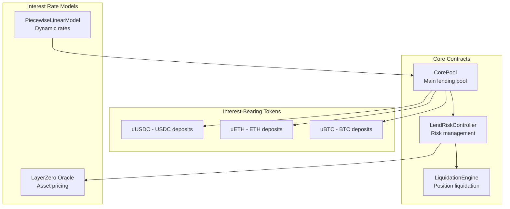
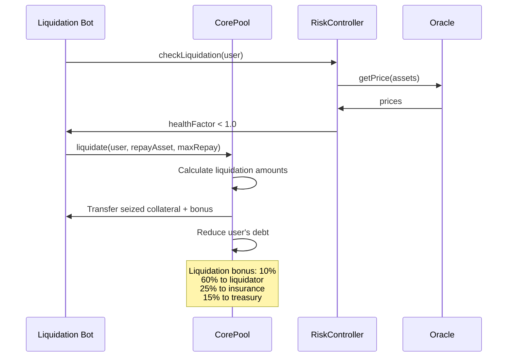

# Unxversal Lend Protocol - Technical Overview

## Introduction

The Unxversal Lend Protocol is a **permissionless lending and borrowing platform** that supports any ERC-20 token as collateral or borrowable asset. It features **flash loans**, **cross-chain oracle pricing**, and **dynamic interest rate models** while integrating seamlessly with other Unxversal protocols.

## Core Architecture



## Key Features

### Permissionless Asset Support
- Any ERC-20 token can be listed as collateral or borrowable
- Governance-controlled risk parameters per asset
- Cross-chain oracle support via LayerZero

### Interest-Bearing Receipt Tokens (uTokens)
- ERC-20 tokens representing supply positions
- Exchange rate increases over time as interest accrues
- Transferable and composable with other DeFi protocols

### Flash Loans
- Uncollateralized loans within single transaction
- 8 bps fee for flash loan usage
- Integration with DEX for instant arbitrage

### Dynamic Interest Rates
- Piecewise linear model with utilization-based rates
- Separate parameters per asset (base rate, slopes, kink point)
- Reserve factor directs portion of interest to treasury

## CorePool Contract

### Asset Pool Structure

```solidity
struct AssetPool {
    address asset;                  // ERC-20 token address
    address uToken;                // Interest-bearing token
    uint256 totalSupply;           // Total supplied amount
    uint256 totalBorrows;          // Total borrowed amount
    uint256 borrowIndex;           // Cumulative borrow interest index
    uint256 supplyIndex;           // Cumulative supply interest index
    uint256 lastUpdateTime;        // Last interest accrual timestamp
    uint256 reserveFactor;         // Percentage to treasury (e.g., 12%)
    uint256 collateralFactor;      // Max borrowing power (e.g., 75%)
    bool isActive;                 // Pool status
}
```

### Core Functions

#### Supply Assets
```solidity
function supply(address asset, uint256 amount) external nonReentrant {
    require(pools[asset].isActive, "Pool not active");
    
    // Accrue interest first
    _accrueInterest(asset);
    
    // Transfer tokens to pool
    IERC20(asset).safeTransferFrom(msg.sender, address(this), amount);
    
    // Calculate uTokens to mint based on current exchange rate
    uint256 exchangeRate = _getExchangeRate(asset);
    uint256 uTokensToMint = amount * 1e18 / exchangeRate;
    
    // Update pool state
    pools[asset].totalSupply += amount;
    
    // Mint uTokens to supplier
    IUToken(pools[asset].uToken).mint(msg.sender, uTokensToMint);
    
    emit Supply(msg.sender, asset, amount, uTokensToMint);
}
```

#### Borrow Assets
```solidity
function borrow(address asset, uint256 amount) external nonReentrant {
    require(pools[asset].isActive, "Pool not active");
    require(amount <= _getAvailableLiquidity(asset), "Insufficient liquidity");
    
    // Accrue interest
    _accrueInterest(asset);
    
    // Check borrowing capacity
    require(riskController.checkBorrowAllowed(msg.sender, asset, amount), "Borrow not allowed");
    
    // Update pool state
    pools[asset].totalBorrows += amount;
    userBorrows[msg.sender][asset] += amount;
    
    // Transfer tokens to borrower
    IERC20(asset).safeTransfer(msg.sender, amount);
    
    emit Borrow(msg.sender, asset, amount);
}
```

#### Flash Loans
```solidity
function flashLoan(
    address asset,
    uint256 amount,
    bytes calldata data
) external nonReentrant {
    require(amount <= _getAvailableLiquidity(asset), "Insufficient liquidity");
    
    uint256 fee = amount * flashLoanFeeBps / 10000;
    uint256 balanceBefore = IERC20(asset).balanceOf(address(this));
    
    // Transfer tokens to borrower
    IERC20(asset).safeTransfer(msg.sender, amount);
    
    // Execute borrower's logic
    IFlashLoanReceiver(msg.sender).executeOperation(asset, amount, fee, data);
    
    // Verify repayment
    uint256 balanceAfter = IERC20(asset).balanceOf(address(this));
    require(balanceAfter >= balanceBefore + fee, "Flash loan not repaid");
    
    // Distribute fee (80% treasury, 20% rebate pool)
    _distributeFlashLoanFee(asset, fee);
    
    emit FlashLoan(msg.sender, asset, amount, fee);
}
```

## Interest Rate Model

### Piecewise Linear Calculation

```ascii
Interest Rate Curve:

     Annual Rate (%)
           │
       300%│                     ╱
           │                   ╱
           │                 ╱ slope2
       100%│               ╱
           │             ╱
        50%│           ╱
           │         ╱ slope1
        10%│       ╱
           │     ╱
         2%│───╱────────────────────────── Utilization (%)
           0%  20%  40%  60%  80%  100%
                         │
                      Kink Point (80%)

Formula:
if utilization <= kink:
    rate = baseRate + (utilization * slope1 / kink)
else:
    rate = baseRate + slope1 + ((utilization - kink) * slope2 / (100 - kink))
```

### Asset-Specific Parameters

```ascii
Interest Rate Parameters:
┌──────────┬─────────┬─────────┬─────────┬─────────┬─────────┐
│ Asset    │ Base    │ Slope1  │ Slope2  │ Kink    │ Reserve │
├──────────┼─────────┼─────────┼─────────┼─────────┼─────────┤
│ USDC     │ 0%      │ 5%      │ 300%    │ 80%     │ 10%     │
│ WETH     │ 0.5%    │ 8%      │ 400%    │ 75%     │ 15%     │
│ sBTC     │ 1%      │ 10%     │ 500%    │ 70%     │ 20%     │
│ sETH     │ 1%      │ 10%     │ 500%    │ 70%     │ 20%     │
│ WPEAQ    │ 2%      │ 15%     │ 600%    │ 65%     │ 25%     │
└──────────┴─────────┴─────────┴─────────┴─────────┴─────────┘

Collateral Factors:
┌──────────┬─────────────┬─────────────┬─────────────┐
│ Asset    │ Collateral  │ Liquidation │ Close       │
│          │ Factor      │ Threshold   │ Factor      │
├──────────┼─────────────┼─────────────┼─────────────┤
│ USDC     │ 85%         │ 88%         │ 50%         │
│ WETH     │ 75%         │ 80%         │ 50%         │
│ sBTC     │ 70%         │ 75%         │ 50%         │
│ sETH     │ 70%         │ 75%         │ 50%         │
│ WPEAQ    │ 60%         │ 65%         │ 40%         │
└──────────┴─────────────┴─────────────┴─────────────┘
```

## Risk Management

### Health Factor Calculation

```solidity
function calculateHealthFactor(address user) external view returns (uint256) {
    uint256 totalCollateralValue = 0;
    uint256 totalBorrowValue = 0;
    
    // Calculate total collateral value
    for (uint256 i = 0; i < suppliedAssets[user].length; i++) {
        address asset = suppliedAssets[user][i];
        uint256 balance = userSupplies[user][asset];
        uint256 price = oracle.getPrice(asset);
        uint256 collateralFactor = pools[asset].collateralFactor;
        
        totalCollateralValue += balance * price * collateralFactor / (1e18 * 10000);
    }
    
    // Calculate total borrow value
    for (uint256 i = 0; i < borrowedAssets[user].length; i++) {
        address asset = borrowedAssets[user][i];
        uint256 balance = userBorrows[user][asset];
        uint256 price = oracle.getPrice(asset);
        
        totalBorrowValue += balance * price / 1e18;
    }
    
    if (totalBorrowValue == 0) return type(uint256).max;
    
    return totalCollateralValue * 1e18 / totalBorrowValue;
}
```

### Liquidation Process



## uToken Implementation

### Interest-Bearing Receipt Tokens

```solidity
contract UToken is ERC20 {
    ICorePool public immutable pool;
    address public immutable underlying;
    
    function exchangeRate() public view returns (uint256) {
        uint256 totalSupply = totalSupply();
        if (totalSupply == 0) return 1e18;
        
        uint256 cash = IERC20(underlying).balanceOf(address(pool));
        uint256 borrows = pool.totalBorrows(underlying);
        uint256 reserves = pool.totalReserves(underlying);
        
        return (cash + borrows - reserves) * 1e18 / totalSupply;
    }
    
    function mint(address to, uint256 amount) external onlyPool {
        _mint(to, amount);
    }
    
    function burn(address from, uint256 amount) external onlyPool {
        _burn(from, amount);
    }
}
```

## Flash Loan Integration

### Arbitrage Example

```solidity
contract ArbitrageBot is IFlashLoanReceiver {
    function executeArbitrage(
        address assetA,
        address assetB,
        uint256 amount
    ) external {
        // Request flash loan
        ICorePool(lendPool).flashLoan(assetA, amount, abi.encode(assetB));
    }
    
    function executeOperation(
        address asset,
        uint256 amount,
        uint256 fee,
        bytes calldata data
    ) external override {
        address assetB = abi.decode(data, (address));
        
        // 1. Swap asset A to B on DEX
        uint256 amountB = _swapOnDEX(asset, assetB, amount);
        
        // 2. Swap B back to A (hopefully with profit)
        uint256 amountABack = _swapOnDEX(assetB, asset, amountB);
        
        // 3. Ensure we have enough to repay loan + fee
        require(amountABack >= amount + fee, "Arbitrage not profitable");
        
        // 4. Approve repayment
        IERC20(asset).approve(msg.sender, amount + fee);
    }
}
```

## Integration with Other Protocols

### Cross-Protocol Liquidations

```ascii
Cross-Protocol Liquidation Flow:
┌─────────────────────────────────────────────────────────────┐
│ 1. Monitor positions across all Unxversal protocols       │
│ 2. Detect liquidatable position in Synth protocol         │
│ 3. Flash loan USDC from Lend protocol                     │
│ 4. Purchase sBTC on DEX to repay Synth debt              │
│ 5. Liquidate Synth position → receive USDC collateral    │
│ 6. Repay flash loan + keep liquidation bonus             │
└─────────────────────────────────────────────────────────────┘

Benefits:
• Capital efficient (no upfront investment)
• Cross-protocol arbitrage opportunities
• Improved protocol stability through fast liquidations
• Liquidator profit from bonus rewards
```

### Yield Farming Integration

```solidity
contract LendYieldFarmer {
    function farmUSDCYield(uint256 amount) external {
        // 1. Supply USDC to earn base yield
        lendPool.supply(USDC, amount);
        
        // 2. Borrow sBTC against USDC collateral
        uint256 borrowAmount = amount * 70 / 100; // 70% LTV
        lendPool.borrow(sBTC, borrowAmount);
        
        // 3. Sell sBTC for USDC on DEX
        uint256 usdcFromSale = dex.swap(sBTC, USDC, borrowAmount);
        
        // 4. Supply additional USDC
        lendPool.supply(USDC, usdcFromSale);
        
        // Net result: Leveraged USDC yield farming
        // Risk: sBTC price appreciation (short sBTC exposure)
    }
}
```

## Performance Metrics

### Key Performance Indicators

```ascii
Lend Protocol Metrics:
┌─────────────────────────────────────────────────────────────┐
│ Total Value Locked (TVL): $50M                             │
│ Total Borrows: $35M                                        │
│ Utilization Rate: 70%                                      │
│                                                             │
│ Asset Breakdown:                                            │
│ ├─ USDC: $20M supplied, $15M borrowed (75% util)          │
│ ├─ WETH: $15M supplied, $10M borrowed (67% util)          │
│ ├─ sBTC: $10M supplied, $7M borrowed (70% util)           │
│ └─ sETH: $5M supplied, $3M borrowed (60% util)            │
│                                                             │
│ Flash Loan Volume (24h): $2.5M                            │
│ Liquidations (24h): $150K                                  │
│ Reserve Earnings (24h): $800                               │
└─────────────────────────────────────────────────────────────┘
```

This lending protocol provides comprehensive DeFi lending infrastructure with flash loans, dynamic rates, and seamless integration with the broader Unxversal ecosystem for maximum capital efficiency. 