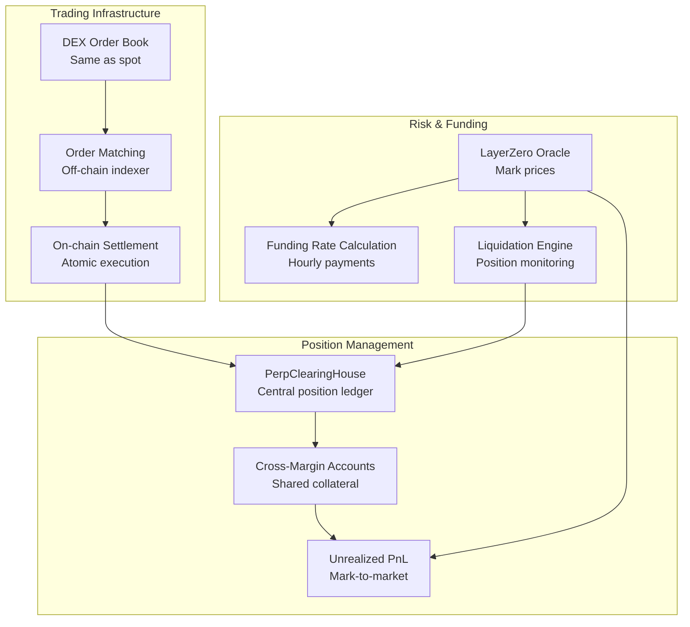
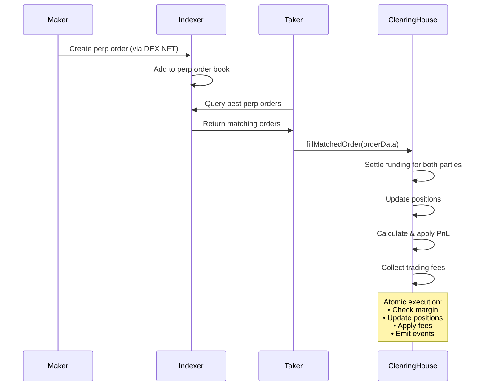
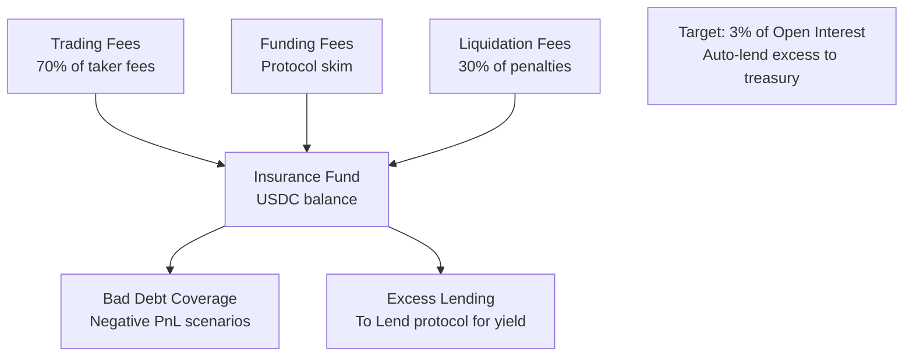

# Unxversal Perps Protocol - Technical Overview

## Introduction

The Unxversal Perps Protocol provides **cross-margin perpetual futures** with up to **25x leverage** on crypto assets. It features **hourly funding rates**, **order-book matching** via the DEX infrastructure, and **robust risk management** to ensure protocol solvency.

## Core Architecture



## Key Features

### Cross-Margin System
- **Shared collateral** across all positions
- **Portfolio margining** with position netting
- **Leverage up to 25x** on major pairs
- **USDC-denominated** margin and PnL

### Funding Rate Mechanism
- **Hourly funding payments** between longs and shorts
- **Premium-based calculation**: (Mark Price - Index Price) / Index Price
- **Capped at ±0.75%** per hour to prevent manipulation
- **Protocol fee on funding** (10-15% skim)

### Order Book Integration
- **Same infrastructure** as spot DEX
- **NFT-encoded orders** with perpetual-specific data
- **Price-time priority** maintained
- **MEV protection** via relayer network

### Liquidation System
- **4% minimum maintenance margin** for major assets
- **Partial liquidations** to restore health
- **2.5% liquidation fee** split between liquidator and insurance
- **Flash liquidation** support for capital efficiency

## Position Management

### Position Structure

```solidity
struct Position {
    int256 sizeUsdc;                 // Position size in USD (+ long, - short)
    uint256 entryPrice;              // Volume-weighted average entry price
    int256 lastFundingIndex;         // Last funding index for payments
    uint256 lastUpdateTime;          // Last position modification
    uint256 collateralUsdc;          // Allocated margin for this position
}

struct Account {
    uint256 totalCollateralUsdc;     // Total USDC balance
    mapping(bytes32 => Position) positions;  // Market → Position
    EnumerableSet.Bytes32Set openMarkets;    // Active markets
}
```

### Margin Calculations

```ascii
Margin Requirements:

Initial Margin = Position Size / Max Leverage
Maintenance Margin = Position Size × Maintenance Margin Rate

Example for BTC-PERP (25x leverage, 4% maintenance):
• Position Size: $100,000 long BTC
• Initial Margin: $100,000 / 25 = $4,000
• Maintenance Margin: $100,000 × 4% = $4,000

Health Factor = (Margin Balance + Unrealized PnL) / Maintenance Margin

Liquidation triggers when Health Factor < 1.0
```

### Risk Parameters by Market

```ascii
Market Risk Parameters:
┌──────────┬─────────────┬─────────────┬─────────────┬─────────────┐
│ Market   │ Max Lev     │ Maint Margin│ Liq Fee     │ Min Size    │
├──────────┼─────────────┼─────────────┼─────────────┼─────────────┤
│ BTC-PERP │ 25x         │ 4%          │ 2.5%        │ $50         │
│ ETH-PERP │ 25x         │ 5%          │ 2.5%        │ $50         │
│ SOL-PERP │ 20x         │ 6%          │ 3%          │ $25         │
│ PEAQ-PERP│ 15x         │ 8%          │ 4%          │ $25         │
│ ALT-PERP │ 10x         │ 10%         │ 5%          │ $25         │
└──────────┴─────────────┴─────────────┴─────────────┴─────────────┘

Position Limits:
• Max position size per market: $10,000,000
• Max leverage across portfolio: 25x
• Max open markets per account: 20
```

## Funding Rate System

### Funding Calculation

```mermaid
graph TB
    MarkPrice[Mark Price<br/>Oracle TWAP 1-min]
    IndexPrice[Index Price<br/>DEX TWAP recent trades]
    
    Premium[Premium = (Mark - Index) / Index]
    FundingRate[Funding Rate = Premium / 24<br/>Capped at ±0.75% per hour]
    
    Longs[Long Positions<br/>Pay when Premium > 0]
    Shorts[Short Positions<br/>Receive when Premium > 0]
    
    MarkPrice --> Premium
    IndexPrice --> Premium
    Premium --> FundingRate
    
    FundingRate --> Longs
    FundingRate --> Shorts
```

### Funding Implementation

```solidity
function settleFunding(bytes32 marketId) external {
    MarketState storage state = marketStates[marketId];
    MarketConfig storage market = markets[marketId];
    
    // Get current prices
    uint256 markPrice = markPriceOracle.getPrice(market.oracleAssetId);
    uint256 indexPrice = market.spotOracle.getPrice();
    
    // Calculate premium and funding rate
    int256 premium = (int256(markPrice) - int256(indexPrice)) * 1e18 / int256(indexPrice);
    int256 fundingRate = premium / 24; // Hourly rate
    
    // Apply funding cap
    int256 maxFunding = int256(market.maxFundingRateBps * 1e14); // Convert to 1e18
    fundingRate = _clamp(fundingRate, -maxFunding, maxFunding);
    
    // Update cumulative funding index
    state.cumulativeFundingIndex += fundingRate;
    state.lastFundingTime = block.timestamp;
    state.nextFundingTime = block.timestamp + market.fundingIntervalSec;
    
    emit FundingRateCalculated(marketId, fundingRate, block.timestamp);
}

function _settleFunding(address trader, bytes32 marketId) internal {
    Position storage position = accounts[trader].positions[marketId];
    if (position.sizeUsdc == 0) return;
    
    MarketState storage state = marketStates[marketId];
    int256 fundingDelta = state.cumulativeFundingIndex - position.lastFundingIndex;
    
    if (fundingDelta != 0) {
        // Calculate funding payment
        int256 fundingPayment = (position.sizeUsdc * fundingDelta) / 1e18;
        
        if (fundingPayment > 0) {
            // Trader pays funding
            accounts[trader].totalCollateralUsdc -= uint256(fundingPayment);
        } else {
            // Trader receives funding
            accounts[trader].totalCollateralUsdc += uint256(-fundingPayment);
        }
        
        position.lastFundingIndex = state.cumulativeFundingIndex;
        emit FundingPaymentApplied(trader, marketId, fundingPayment, position.sizeUsdc);
    }
}
```

## Order Execution

### Perpetual Order Flow



### Position Updates

```solidity
function _updatePosition(
    address trader,
    bytes32 marketId,
    int256 tradeSize,
    uint256 price,
    bool isTaker,
    bool isLiquidation
) internal returns (int256 realizedPnl, uint256 tradeFee) {
    Position storage position = accounts[trader].positions[marketId];
    MarketConfig storage market = markets[marketId];
    
    int256 oldSize = position.sizeUsdc;
    int256 newSize = oldSize + tradeSize;
    
    // Calculate trading fee
    if (!isLiquidation) {
        uint256 absTradeSize = uint256(tradeSize > 0 ? tradeSize : -tradeSize);
        if (isTaker) {
            tradeFee = absTradeSize * market.takerFeeBps / 10000;
        } else if (market.makerFeeBps > 0) {
            tradeFee = absTradeSize * uint256(market.makerFeeBps) / 10000;
        }
    }
    
    // Calculate realized PnL for position changes
    if (oldSize != 0 && (oldSize > 0) != (tradeSize > 0)) {
        // Position is being reduced or flipped
        uint256 reduceSize = Math.min(
            uint256(tradeSize > 0 ? tradeSize : -tradeSize),
            uint256(oldSize > 0 ? oldSize : -oldSize)
        );
        realizedPnl = _calculateRealizedPnl(oldSize, reduceSize, position.entryPrice, price);
    }
    
    // Update position entry price for increases/new positions
    if (newSize != 0) {
        if (oldSize == 0 || (oldSize > 0) != (newSize > 0)) {
            // New position or flipped
            position.entryPrice = price;
        } else if ((oldSize > 0) == (newSize > 0)) {
            // Same direction, update weighted average
            uint256 oldValue = uint256(oldSize > 0 ? oldSize : -oldSize) * position.entryPrice;
            uint256 newValue = uint256(tradeSize > 0 ? tradeSize : -tradeSize) * price;
            position.entryPrice = (oldValue + newValue) / uint256(newSize > 0 ? newSize : -newSize);
        }
        
        position.sizeUsdc = newSize;
        if (!accounts[trader].openMarkets.contains(marketId)) {
            accounts[trader].openMarkets.add(marketId);
        }
    } else {
        // Position closed
        position.sizeUsdc = 0;
        position.entryPrice = 0;
        accounts[trader].openMarkets.remove(marketId);
    }
    
    position.lastUpdateTime = block.timestamp;
    position.lastFundingIndex = marketStates[marketId].cumulativeFundingIndex;
}
```

## Liquidation Engine

### Liquidation Process

```ascii
Liquidation Trigger & Execution:

1. Position Monitoring:
   ┌─────────────────────────────────────────┐
   │ Health Factor = (Margin + PnL) / Maint  │
   │ Liquidation when Health Factor < 1.0    │
   └─────────────────────────────────────────┘

2. Liquidation Amount:
   ┌─────────────────────────────────────────┐
   │ Close Factor: Max 50% of position size  │
   │ Amount = min(positionSize * 0.5, amount)│
   │ Goal: Restore health factor > 1.2       │
   └─────────────────────────────────────────┘

3. Liquidation Rewards:
   ┌─────────────────────────────────────────┐
   │ Fee = liquidated_notional × 2.5%        │
   │ Distribution:                           │
   │ • 70% to liquidator                    │
   │ • 30% to insurance fund                │
   └─────────────────────────────────────────┘
```

### Flash Liquidation Strategy

```solidity
contract FlashLiquidator {
    function flashLiquidate(
        address user,
        bytes32 marketId,
        uint256 maxNotional
    ) external {
        // 1. Flash loan from Lend protocol
        uint256 loanAmount = _calculateOptimalLoan(user, marketId, maxNotional);
        lendPool.flashLoan(USDC, loanAmount, abi.encode(user, marketId, maxNotional));
    }
    
    function executeOperation(
        address asset,
        uint256 amount,
        uint256 fee,
        bytes calldata data
    ) external override {
        (address user, bytes32 marketId, uint256 maxNotional) = abi.decode(
            data, (address, bytes32, uint256)
        );
        
        // 2. Liquidate position
        int256 realizedPnl = clearingHouse.processLiquidation(
            user, marketId, int256(maxNotional), getCurrentPrice(marketId), amount
        );
        
        // 3. Should receive liquidation fee + any positive PnL
        uint256 totalReceived = amount + uint256(realizedPnl > 0 ? realizedPnl : 0);
        
        // 4. Repay flash loan
        require(totalReceived >= amount + fee, "Liquidation not profitable");
        IERC20(USDC).approve(msg.sender, amount + fee);
        
        // 5. Keep profit
        uint256 profit = totalReceived - amount - fee;
        // Profit comes from liquidation penalty + favorable price execution
    }
}
```

## Fee Structure

### Trading Fees

```ascii
Perpetual Trading Fees:
┌─────────────────────────────────────────────────────────────┐
│ Taker Fee: 10 bps (0.10%) on notional                     │
│ Maker Rebate: -5 bps (-0.05%) (negative fee)              │
│                                                             │
│ Fee Distribution:                                           │
│ ├─ 70% → Insurance Fund                                    │
│ ├─ 20% → Treasury                                          │
│ └─ 10% → Maker Rebate Pool                                 │
│                                                             │
│ Volume Discounts (same as DEX):                            │
│ • Tier 1 (<$100K): 0% discount                           │
│ • Tier 2 ($100K+): 20% discount                          │
│ • Tier 3 ($1M+): 40% discount                            │
│ • Tier 4 ($10M+): 60% discount                           │
│                                                             │
│ UNXV Staking Bonus:                                        │
│ • 1,000+ UNXV: Additional 10% off                         │
│ • 10,000+ UNXV: Additional 20% off                        │
└─────────────────────────────────────────────────────────────┘
```

### Funding Fees

```solidity
function _collectFundingFee(
    address payer,
    uint256 grossFunding,
    bytes32 marketId
) internal {
    MarketConfig storage market = markets[marketId];
    uint256 protocolFee = grossFunding * market.fundingProtocolFeeBps / 10000;
    
    // Deduct protocol fee from gross funding
    uint256 netFunding = grossFunding - protocolFee;
    
    // Send protocol fee to insurance fund
    accounts[payer].totalCollateralUsdc -= protocolFee;
    // Transfer to insurance fund handled by external call
    
    return netFunding;
}
```

## Risk Management

### Portfolio Risk Assessment

```ascii
Cross-Margin Risk Calculation:

Total Portfolio Value = Collateral + Σ(Unrealized PnL)
Total Maintenance Margin = Σ(|Position Size| × Maintenance Margin Rate)

Portfolio Health = Total Portfolio Value / Total Maintenance Margin

Risk Limits:
┌─────────────────────────────────────────────────────────────┐
│ • Max 20 open positions per account                        │
│ • Max $10M position size per market                        │
│ • Max 25x effective leverage across portfolio              │
│ • Circuit breakers on 10%+ price moves                     │
│ • Insurance fund target: 3% of total open interest        │
└─────────────────────────────────────────────────────────────┘

Auto-Deleveraging (ADL):
When insurance fund insufficient → close profitable positions
Priority: Highest PnL × leverage ratio first
```

### Insurance Fund Management



This perpetuals protocol provides professional-grade futures trading with robust risk management, efficient capital usage through cross-margin accounts, and seamless integration with the broader Unxversal ecosystem. 