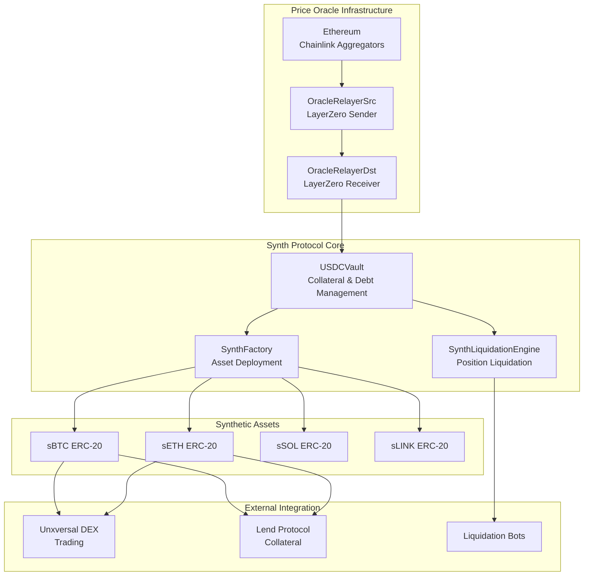
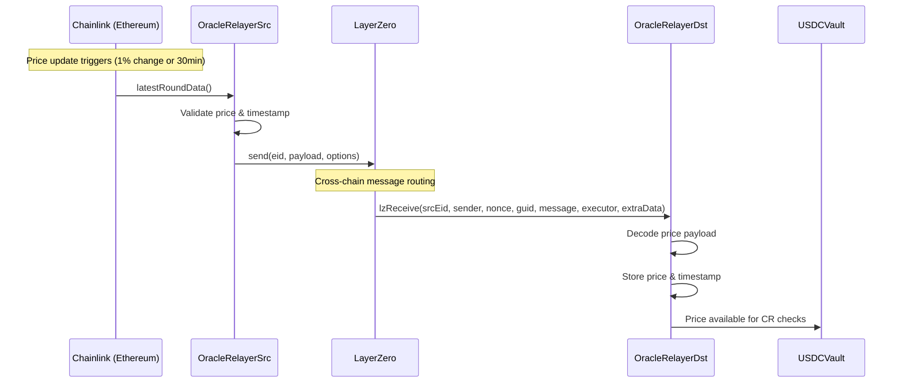

# Unxversal Synth Protocol - Technical Overview

## Introduction

The Unxversal Synth Protocol enables users to **mint synthetic assets** (sBTC, sETH, sSOL, etc.) backed by **USDC collateral**. It leverages **LayerZero cross-chain oracles** to bring Chainlink price feeds from Ethereum/Polygon to Peaq EVM, enabling robust price discovery for synthetic asset creation and liquidation.

## Core Architecture

The protocol consists of:
- **USDCVault**: Collateral and debt management
- **SynthFactory**: Synthetic asset deployment  
- **OracleRelayerDst**: LayerZero price feeds
- **LiquidationEngine**: Position liquidation
- **SynthTokens**: ERC-20 synthetic assets

## Key Features

### USDC-Only Collateral
- Simplified accounting with stable collateral
- 150% minimum collateral ratio for major assets
- 12% liquidation penalty for fast liquidation

### Cross-Chain Oracles
- LayerZero integration for Ethereum → Peaq price feeds
- 30-minute staleness tolerance
- Circuit breakers for price deviation protection

### Liquidation System
- Automated liquidation bots
- Flash loan integration for capital efficiency
- Penalty distribution: 50% liquidator, 30% surplus, 20% treasury

### Fee Structure
- Mint fee: 15 bps
- Burn fee: 8 bps  
- Stability fee: 2% APR on debt
- All fees auto-converted to USDC

This protocol provides stable, over-collateralized synthetic assets that integrate seamlessly with the broader Unxversal ecosystem for trading, lending, and yield generation.

## Architecture

### Core Components



## USDCVault - Core Collateral Management

### Position Structure

```solidity
struct Position {
    uint256 collateralAmount;      // USDC collateral deposited
    mapping(address => uint256) synthDebt;  // Debt per synthetic asset
    uint256 lastInteractionTime;   // For stability fee calculation
    bool isActive;                 // Position status
}

struct SynthConfig {
    address synthToken;            // Synthetic asset address
    uint256 oracleAssetId;        // LayerZero oracle asset ID
    uint256 minCollateralRatio;   // Minimum CR (e.g., 150%)
    uint256 liquidationPenalty;   // Liquidation penalty (e.g., 12%)
    uint256 mintFee;              // Mint fee in bps (e.g., 15)
    uint256 burnFee;              // Burn fee in bps (e.g., 8)
    uint256 stabilityFeeRate;     // Annual stability fee rate
    uint256 debtCeiling;          // Maximum debt for this synth
    bool isActive;                // Asset status
}
```

### Key Functions

#### Deposit Collateral
```solidity
function depositCollateral(uint256 amount) external nonReentrant {
    require(amount > 0, "Zero amount");
    
    IERC20(usdcToken).safeTransferFrom(msg.sender, address(this), amount);
    positions[msg.sender].collateralAmount += amount;
    
    emit CollateralDeposited(msg.sender, amount);
}
```

#### Mint Synthetic Assets
```solidity
function mintSynth(
    address synthAsset,
    uint256 amount
) external nonReentrant {
    require(synthConfigs[synthAsset].isActive, "Synth not active");
    
    // Update stability fees first
    _accrueStabilityFee(msg.sender, synthAsset);
    
    // Check collateral ratio
    uint256 newDebt = positions[msg.sender].synthDebt[synthAsset] + amount;
    require(_checkCollateralRatio(msg.sender, synthAsset, newDebt), "Insufficient collateral");
    
    // Check debt ceiling
    require(totalDebt[synthAsset] + amount <= synthConfigs[synthAsset].debtCeiling, "Debt ceiling exceeded");
    
    // Collect mint fee
    uint256 fee = amount * synthConfigs[synthAsset].mintFee / 10000;
    require(positions[msg.sender].collateralAmount >= fee, "Insufficient collateral for fee");
    positions[msg.sender].collateralAmount -= fee;
    
    // Update debt and mint tokens
    positions[msg.sender].synthDebt[synthAsset] = newDebt;
    totalDebt[synthAsset] += amount;
    
    ISynthToken(synthAsset).mint(msg.sender, amount);
    
    _distributeMintFee(fee);
    emit SynthMinted(msg.sender, synthAsset, amount, fee);
}
```

#### Burn Synthetic Assets  
```solidity
function burnSynth(
    address synthAsset,
    uint256 amount
) external nonReentrant {
    require(amount > 0, "Zero amount");
    require(positions[msg.sender].synthDebt[synthAsset] >= amount, "Insufficient debt");
    
    // Update stability fees
    _accrueStabilityFee(msg.sender, synthAsset);
    
    // Collect burn fee
    uint256 fee = amount * synthConfigs[synthAsset].burnFee / 10000;
    require(positions[msg.sender].collateralAmount >= fee, "Insufficient collateral for fee");
    positions[msg.sender].collateralAmount -= fee;
    
    // Burn tokens and reduce debt
    ISynthToken(synthAsset).burnFrom(msg.sender, amount);
    positions[msg.sender].synthDebt[synthAsset] -= amount;
    totalDebt[synthAsset] -= amount;
    
    _distributeBurnFee(fee);
    emit SynthBurned(msg.sender, synthAsset, amount, fee);
}
```

#### Withdraw Collateral
```solidity
function withdrawCollateral(uint256 amount) external nonReentrant {
    require(amount > 0, "Zero amount");
    require(positions[msg.sender].collateralAmount >= amount, "Insufficient collateral");
    
    // Check if withdrawal maintains minimum collateral ratio
    uint256 newCollateral = positions[msg.sender].collateralAmount - amount;
    require(_checkAllCollateralRatios(msg.sender, newCollateral), "Would violate CR");
    
    positions[msg.sender].collateralAmount = newCollateral;
    IERC20(usdcToken).safeTransfer(msg.sender, amount);
    
    emit CollateralWithdrawn(msg.sender, amount);
}
```

## Collateral Ratio Calculations

### Health Factor Formula

```ascii
Health Factor Calculation:

                    Collateral Value (USD)
Health Factor = ─────────────────────────────
                     Debt Value (USD)

Example:
• Collateral: 1,500 USDC
• Debt: 1 sBTC at $50,000 = $1,000 USD  
• Health Factor = $1,500 / $1,000 = 1.50 (150%)

Liquidation Trigger:
if health_factor < min_collateral_ratio:
    trigger_liquidation()

Asset-Specific Requirements:
┌──────────┬─────────────┬─────────────┬─────────────┬─────────────┐
│ Asset    │ Min CR      │ Liq Penalty │ Mint Fee    │ Burn Fee    │
├──────────┼─────────────┼─────────────┼─────────────┼─────────────┤
│ sBTC     │ 150%        │ 12%         │ 15 bps      │ 8 bps       │
│ sETH     │ 150%        │ 12%         │ 15 bps      │ 8 bps       │
│ sSOL     │ 160%        │ 15%         │ 20 bps      │ 10 bps      │
│ sLINK    │ 170%        │ 18%         │ 25 bps      │ 12 bps      │
│ sAVAX    │ 160%        │ 15%         │ 20 bps      │ 10 bps      │
└──────────┴─────────────┴─────────────┴─────────────┴─────────────┘
```

### Multi-Asset Position Management

```solidity
function _checkAllCollateralRatios(
    address user,
    uint256 newCollateralAmount
) internal view returns (bool) {
    uint256 totalDebtValue = 0;
    
    // Calculate total debt value across all synthetic assets
    for (uint256 i = 0; i < synthAssets.length; i++) {
        address synthAsset = synthAssets[i];
        uint256 debt = positions[user].synthDebt[synthAsset];
        
        if (debt > 0) {
            uint256 price = oracle.getPrice(synthConfigs[synthAsset].oracleAssetId);
            uint256 debtValue = debt * price / 1e18;
            totalDebtValue += debtValue;
            
            // Check individual asset CR
            uint256 assetCR = (newCollateralAmount * 1e18) / debtValue;
            if (assetCR < synthConfigs[synthAsset].minCollateralRatio * 1e16) {
                return false;
            }
        }
    }
    
    if (totalDebtValue == 0) return true;
    
    // Check overall portfolio CR
    uint256 overallCR = (newCollateralAmount * 1e18) / totalDebtValue;
    return overallCR >= globalMinCollateralRatio * 1e16;
}
```

## LayerZero Oracle Integration

### Cross-Chain Price Feed



### Oracle Data Structure

```solidity
struct PriceData {
    uint256 price;          // Price in 1e18 precision
    uint256 timestamp;      // Last update timestamp
    uint256 roundId;        // Chainlink round ID
    bool isValid;           // Price validity flag
}

struct OracleConfig {
    uint256 assetId;        // Unique asset identifier
    address chainlinkFeed;  // Source Chainlink aggregator
    uint256 heartbeat;      // Expected update frequency
    uint256 deviation;      // Price change threshold for updates
    uint8 decimals;         // Price decimals
    bool isActive;          // Oracle status
}

// Price storage with staleness protection
mapping(uint256 => PriceData) public prices;
mapping(uint256 => OracleConfig) public oracleConfigs;

function getPrice(uint256 assetId) external view returns (uint256) {
    PriceData memory priceData = prices[assetId];
    require(priceData.isValid, "Invalid price");
    require(
        block.timestamp - priceData.timestamp <= staleTolerance,
        "Stale price"
    );
    return priceData.price;
}
```

## Liquidation Mechanism

### Liquidation Engine

```solidity
contract SynthLiquidationEngine {
    struct LiquidationParams {
        address user;
        address synthAsset;
        uint256 debtToRepay;
        uint256 collateralToSeize;
        uint256 liquidationPenalty;
    }
    
    function liquidatePosition(
        address user,
        address synthAsset,
        uint256 maxDebtToRepay
    ) external nonReentrant returns (uint256 collateralSeized) {
        require(_isLiquidatable(user, synthAsset), "Position not liquidatable");
        
        LiquidationParams memory params = _calculateLiquidation(
            user, 
            synthAsset, 
            maxDebtToRepay
        );
        
        // Burn synthetic tokens from liquidator
        ISynthToken(synthAsset).burnFrom(msg.sender, params.debtToRepay);
        
        // Transfer collateral to liquidator (including penalty)
        vault.transferCollateral(
            user,
            msg.sender, 
            params.collateralToSeize + params.liquidationPenalty
        );
        
        // Reduce user's debt
        vault.reduceDebt(user, synthAsset, params.debtToRepay);
        
        emit PositionLiquidated(
            user,
            msg.sender,
            synthAsset,
            params.debtToRepay,
            params.collateralToSeize,
            params.liquidationPenalty
        );
        
        return params.collateralToSeize;
    }
}
```

### Liquidation Bot Strategy

```ascii
Liquidation Bot Flow:
┌─────────────────────────────────────────────────────────────┐
│ 1. Monitor all positions for CR < min_collateral_ratio     │
│ 2. Calculate optimal liquidation amount                    │
│ 3. Use flash loan to acquire synthetic tokens             │
│ 4. Execute liquidation to seize collateral + penalty      │
│ 5. Swap collateral on DEX back to USDC                    │
│ 6. Repay flash loan + keep profit                         │
└─────────────────────────────────────────────────────────────┘

Profit Calculation:
┌─────────────────────────────────────────────────────────────┐
│ Liquidation Penalty: 12%                                   │
│ Distribution:                                               │
│ • 50% to liquidator (6%)                                  │
│ • 30% to surplus buffer (3.6%)                           │
│ • 20% to treasury (2.4%)                                  │
│                                                             │
│ Example for $10,000 debt liquidation:                     │
│ • Liquidator profit: $600                                 │
│ • Surplus buffer: $360                                     │
│ • Treasury fee: $240                                       │
└─────────────────────────────────────────────────────────────┘
```

## Stability Fee System

### Continuous Fee Accrual

```solidity
struct StabilityFeeData {
    uint256 rate;               // Annual rate in 1e18 precision (e.g., 2% = 0.02e18)
    uint256 lastUpdateTime;     // Last fee update timestamp
    uint256 accumulatedFee;     // Accumulated fee per unit of debt
}

mapping(address => StabilityFeeData) public stabilityFees;

function _accrueStabilityFee(address user, address synthAsset) internal {
    Position storage position = positions[user];
    SynthConfig storage config = synthConfigs[synthAsset];
    
    if (position.synthDebt[synthAsset] == 0) return;
    
    uint256 timeElapsed = block.timestamp - position.lastInteractionTime;
    uint256 annualRate = config.stabilityFeeRate;
    
    // Calculate compound interest: A = P(1 + r/n)^(nt)
    // Simplified for continuous compounding: A = P * e^(rt)
    // Approximated as: fee = debt * rate * time / (365 days)
    uint256 fee = position.synthDebt[synthAsset] 
                  * annualRate 
                  * timeElapsed 
                  / (365 days * 1e18);
    
    if (fee > 0) {
        // Deduct fee from collateral
        require(position.collateralAmount >= fee, "Insufficient collateral for stability fee");
        position.collateralAmount -= fee;
        
        // Send fee to surplus buffer
        _sendToSurplusBuffer(fee);
        
        emit StabilityFeeCollected(user, synthAsset, fee);
    }
    
    position.lastInteractionTime = block.timestamp;
}
```

## Synthetic Asset Implementation

### SynthToken Contract

```solidity
contract SynthToken is ERC20, AccessControl {
    bytes32 public constant MINTER_ROLE = keccak256("MINTER_ROLE");
    bytes32 public constant BURNER_ROLE = keccak256("BURNER_ROLE");
    
    address public immutable vault;
    uint256 public immutable oracleAssetId;
    
    constructor(
        string memory name,
        string memory symbol,
        address _vault,
        uint256 _oracleAssetId
    ) ERC20(name, symbol) {
        vault = _vault;
        oracleAssetId = _oracleAssetId;
        _grantRole(DEFAULT_ADMIN_ROLE, msg.sender);
        _grantRole(MINTER_ROLE, _vault);
        _grantRole(BURNER_ROLE, _vault);
    }
    
    function mint(address to, uint256 amount) external onlyRole(MINTER_ROLE) {
        _mint(to, amount);
    }
    
    function burnFrom(address from, uint256 amount) external onlyRole(BURNER_ROLE) {
        _burn(from, amount);
    }
    
    // Integration with Unxversal DEX
    function decimals() public pure override returns (uint8) {
        return 18; // Standardized for all synthetic assets
    }
}
```

## Integration Examples

### Minting sBTC

```solidity
// 1. Deposit USDC collateral
vault.depositCollateral(1500 * 1e6); // $1,500 USDC

// 2. Mint sBTC (assuming BTC price = $50,000)
vault.mintSynth(
    sBTC_ADDRESS,
    1 * 1e18  // 1 sBTC ($1,000 value, 150% CR)
);

// 3. Trade sBTC on DEX or use as collateral in Lend
```

### SDK Integration

```typescript
import { UnxversalSDK } from '@unxversal/sdk';

const sdk = new UnxversalSDK({
    network: 'peaq-mainnet',
    privateKey: process.env.PRIVATE_KEY
});

// Monitor position health
const position = await sdk.synth.getPosition(userAddress);
console.log(`Health Factor: ${position.healthFactor}`);
console.log(`Liquidation Price: ${position.liquidationPrice}`);

// Set up liquidation protection
if (position.healthFactor < 1.2) {
    // Automatically add more collateral or burn debt
    await sdk.synth.addCollateral(500 * 1e6); // Add $500 USDC
}
```

## Risk Management

### Circuit Breakers

```solidity
contract SynthCircuitBreaker {
    uint256 public constant MAX_PRICE_DEVIATION = 20; // 20%
    uint256 public constant EMERGENCY_PAUSE_DURATION = 1 hours;
    
    mapping(uint256 => uint256) public lastValidPrices;
    mapping(uint256 => uint256) public pausedUntil;
    
    modifier priceValidation(uint256 assetId) {
        uint256 currentPrice = oracle.getPrice(assetId);
        uint256 lastPrice = lastValidPrices[assetId];
        
        if (lastPrice > 0) {
            uint256 deviation = _calculateDeviation(currentPrice, lastPrice);
            if (deviation > MAX_PRICE_DEVIATION) {
                pausedUntil[assetId] = block.timestamp + EMERGENCY_PAUSE_DURATION;
                emit EmergencyPause(assetId, currentPrice, lastPrice, deviation);
                revert("Price deviation too high");
            }
        }
        
        lastValidPrices[assetId] = currentPrice;
        _;
    }
    
    function emergencyPause(uint256 assetId) external onlyGuardian {
        pausedUntil[assetId] = block.timestamp + EMERGENCY_PAUSE_DURATION;
    }
}
```

### Insurance Fund

```ascii
Surplus Buffer Management:
┌─────────────────────────────────────────────────────────────┐
│ Inflows:                                                    │
│ • 30% of mint fees                                         │
│ • 100% of burn fees                                        │
│ • 30% of liquidation penalties                            │
│ • 100% of stability fees                                   │
│                                                             │
│ Target Size: 5% of total debt value                       │
│                                                             │
│ Outflows:                                                   │
│ • Bad debt coverage (rare)                                 │
│ • Emergency oracle costs                                   │
│ • Surplus → Treasury when > target                        │
└─────────────────────────────────────────────────────────────┘

Auto-Rebalancing:
if surplus_buffer > total_debt * 0.05:
    excess = surplus_buffer - (total_debt * 0.05)
    transfer_to_treasury(excess)
```

This synthetic asset protocol provides a robust foundation for creating USD-stable synthetic exposure to any asset with reliable price feeds, enabling users to trade, lend, and build strategies around synthetic assets while maintaining full USDC backing. 