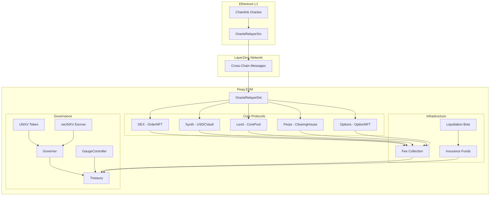

# Unxversal Protocol - Comprehensive Documentation

## Table of Contents
1. [Protocol Overview](#protocol-overview)
2. [Architecture](#architecture)
3. [DEX Protocol](#dex-protocol)
4. [Synth Protocol](#synth-protocol)
5. [Lend Protocol](#lend-protocol)
6. [Perps Protocol](#perps-protocol)
7. [Options Protocol](#options-protocol)
8. [DAO & Governance](#dao--governance)
9. [Cross-Protocol Integration](#cross-protocol-integration)
10. [Example Scenarios](#example-scenarios)
11. [Fee Structure](#fee-structure)
12. [Security & Risk Management](#security--risk-management)

## Protocol Overview

The **Unxversal Protocol** is a comprehensive DeFi suite deployed on **Peaq EVM**, offering:
- **DEX**: Order-book DEX with NFT-encoded orders
- **Synth**: USDC-collateralized synthetic assets (sBTC, sETH, etc.)
- **Lend**: Permissionless lending/borrowing with cross-chain oracles
- **Perps**: Cross-margin perpetual futures with up to 25x leverage
- **Options**: NFT-based options trading with automatic settlement
- **DAO**: UNXV governance with veUNXV voting escrow and gauge emissions

All protocols share unified fee collection (USDC-denominated), LayerZero oracle infrastructure, and DAO governance.

```ascii
                    ╔═══════════════════════════════════════╗
                    ║           UNXVERSAL PROTOCOL          ║
                    ║              (Peaq EVM)               ║
                    ╚═══════════════════════════════════════╝
                                        │
            ┌───────────────┬───────────┼───────────┬───────────────┐
            │               │           │           │               │
        ╔═══▼═══╗       ╔═══▼═══╗   ╔═══▼═══╗   ╔═══▼═══╗       ╔═══▼═══╗
        ║  DEX  ║       ║ SYNTH ║   ║ LEND  ║   ║ PERPS ║       ║  DAO  ║
        ║ Order ║       ║ sBTC  ║   ║ Flash ║   ║ 25x   ║       ║ UNXV  ║
        ║ Book  ║       ║ sETH  ║   ║ Loans ║   ║ Lev   ║       ║ veUNXV║
        ╚═══════╝       ╚═══════╝   ╚═══════╝   ╚═══════╝       ╚═══════╝
            │               │           │           │               │
            └───────────────┴───────────┼───────────┴───────────────┘
                                        │
                        ╔═══════════════▼═══════════════╗
                        ║          OPTIONS             ║
                        ║        NFT-Based             ║
                        ║      European Style          ║
                        ╚═══════════════════════════════╝
```

## Architecture

### System Overview



This comprehensive documentation provides detailed technical specifications, usage examples, and security considerations for the complete Unxversal Protocol suite on Peaq EVM. 