# Unxversal Protocol - Comprehensive Documentation

## Table of Contents
1. [Protocol Overview](#protocol-overview)
2. [Architecture](#architecture)
3. [DEX Protocol](#dex-protocol)
4. [Synth Protocol](#synth-protocol)
5. [Lend Protocol](#lend-protocol)
6. [Perps Protocol](#perps-protocol)
7. [Options Protocol](#options-protocol)
8. [DAO & Governance](#dao--governance)
9. [Cross-Protocol Integration](#cross-protocol-integration)
10. [Example Scenarios](#example-scenarios)
11. [Fee Structure](#fee-structure)
12. [Security & Risk Management](#security--risk-management)

## Protocol Overview

The **Unxversal Protocol** is a comprehensive DeFi suite deployed on **Peaq EVM**, offering:
- **DEX**: Order-book DEX with NFT-encoded orders
- **Synth**: USDC-collateralized synthetic assets (sBTC, sETH, etc.)
- **Lend**: Permissionless lending/borrowing with cross-chain oracles
- **Perps**: Cross-margin perpetual futures with up to 25x leverage
- **Options**: NFT-based options trading with automatic settlement
- **DAO**: UNXV governance with veUNXV voting escrow and gauge emissions

All protocols share unified fee collection (USDC-denominated), LayerZero oracle infrastructure, and DAO governance.

```ascii
                    ╔═══════════════════════════════════════╗
                    ║           UNXVERSAL PROTOCOL          ║
                    ║              (Peaq EVM)               ║
                    ╚═══════════════════════════════════════╝
                                        │
            ┌───────────────┬───────────┼───────────┬───────────────┐
            │               │           │           │               │
        ╔═══▼═══╗       ╔═══▼═══╗   ╔═══▼═══╗   ╔═══▼═══╗       ╔═══▼═══╗
        ║  DEX  ║       ║ SYNTH ║   ║ LEND  ║   ║ PERPS ║       ║  DAO  ║
        ║ Order ║       ║ sBTC  ║   ║ Flash ║   ║ 25x   ║       ║ UNXV  ║
        ║ Book  ║       ║ sETH  ║   ║ Loans ║   ║ Lev   ║       ║ veUNXV║
        ╚═══════╝       ╚═══════╝   ╚═══════╝   ╚═══════╝       ╚═══════╝
            │               │           │           │               │
            └───────────────┴───────────┼───────────┴───────────────┘
                                        │
                        ╔═══════════════▼═══════════════╗
                        ║          OPTIONS             ║
                        ║        NFT-Based             ║
                        ║      European Style          ║
                        ╚═══════════════════════════════╝
```

## Architecture

### System Overview

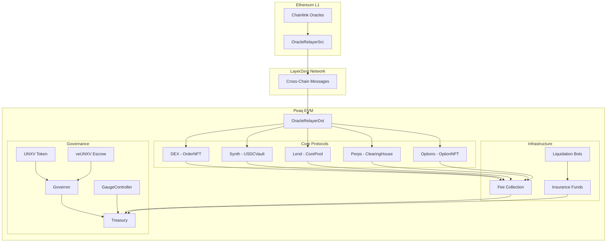
```mermaid
graph TB
    subgraph "Ethereum L1"
        CL[Chainlink Oracles]
        ORS[OracleRelayerSrc]
    end
    
    subgraph "LayerZero Network"
        LZ[Cross-Chain Messages]
    end
    
    subgraph "Peaq EVM"
        ORD[OracleRelayerDst]
        
        subgraph "Core Protocols"
            DEX[DEX - OrderNFT]
            SYNTH[Synth - USDCVault]
            LEND[Lend - CorePool]
            PERPS[Perps - ClearingHouse]
            OPTIONS[Options - OptionNFT]
        end
        
        subgraph "Governance"
            DAO[UNXV Token]
            VEUNXV[veUNXV Escrow]
            GOV[Governor]
            TREASURY[Treasury]
            GAUGES[GaugeController]
        end
        
        subgraph "Infrastructure"
            FEES[Fee Collection]
            LIQUIDATION[Liquidation Bots]
            INSURANCE[Insurance Funds]
        end
    end
    
    CL --> ORS
    ORS --> LZ
    LZ --> ORD
    
    ORD --> DEX
    ORD --> SYNTH
    ORD --> LEND
    ORD --> PERPS
    ORD --> OPTIONS
    
    DAO --> GOV
    VEUNXV --> GOV
    GOV --> TREASURY
    GAUGES --> TREASURY
    
    DEX --> FEES
    SYNTH --> FEES
    LEND --> FEES
    PERPS --> FEES
    OPTIONS --> FEES
    
    FEES --> TREASURY
    LIQUIDATION --> INSURANCE
    INSURANCE --> TREASURY
```

### LayerZero Oracle Flow

```ascii
 Ethereum L1                     LayerZero Network                    Peaq EVM
┌─────────────┐                 ┌─────────────────┐                ┌─────────────┐
│  Chainlink  │                 │                 │                │             │
│ Aggregators │────────────────▶│   LayerZero     │───────────────▶│ OracleRelay │
│ BTC/USD     │  Price Updates  │   Endpoint      │  Cross-Chain   │ erDst.sol   │
│ ETH/USD     │                 │                 │   Messages     │             │
│ SOL/USD     │                 │                 │                │             │
└─────────────┘                 └─────────────────┘                └─────────────┘
       │                                                                    │
       │                                                                    │
       ▼                                                                    ▼
┌─────────────┐                                                    ┌─────────────┐
│OracleRelay  │                                                    │ Unxversal   │
│erSrc.sol    │                                                    │ Protocols   │
│             │                                                    │ • DEX       │
│ • Reads CL  │                                                    │ • Synth     │
│ • Filters   │                                                    │ • Lend      │
│ • Sends LZ  │                                                    │ • Perps     │
└─────────────┘                                                    │ • Options   │
                                                                   └─────────────┘
```

## DEX Protocol

### Order-book DEX Architecture

The DEX uses NFT-encoded orders with off-chain discovery and on-chain settlement.

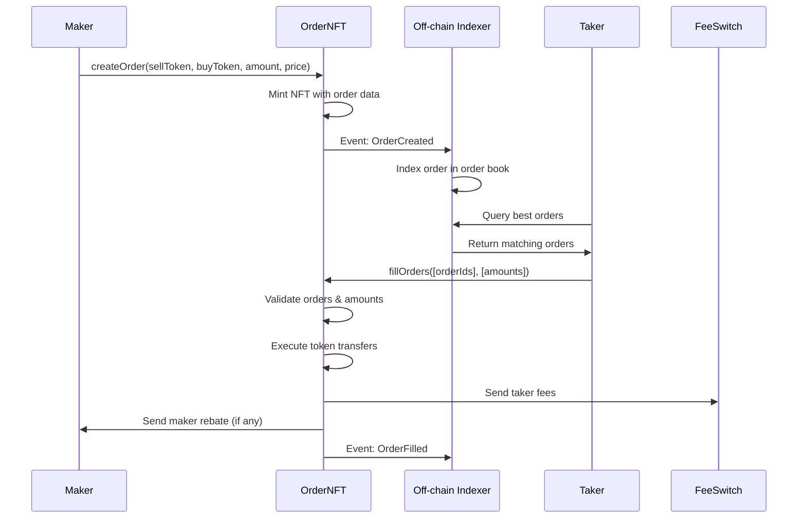
```mermaid
sequenceDiagram
    participant User as Maker
    participant OrderNFT
    participant Indexer as Off-chain Indexer
    participant Taker
    participant FeeSwitch
    
    User->>OrderNFT: createOrder(sellToken, buyToken, amount, price)
    OrderNFT->>OrderNFT: Mint NFT with order data
    OrderNFT->>Indexer: Event: OrderCreated
    
    Indexer->>Indexer: Index order in order book
    
    Taker->>Indexer: Query best orders
    Indexer->>Taker: Return matching orders
    
    Taker->>OrderNFT: fillOrders([orderIds], [amounts])
    OrderNFT->>OrderNFT: Validate orders & amounts
    OrderNFT->>OrderNFT: Execute token transfers
    OrderNFT->>FeeSwitch: Send taker fees
    OrderNFT->>User: Send maker rebate (if any)
    OrderNFT->>Indexer: Event: OrderFilled
```

### Order NFT Structure

```solidity
struct Order {
    address maker;           // Order creator
    address sellToken;       // Token being sold
    address buyToken;        // Token being bought  
    uint256 sellAmount;      // Amount of sellToken
    uint256 buyAmount;       // Amount of buyToken desired
    uint256 price;           // Price in 1e18 precision
    uint64 expiry;          // Expiration timestamp
    uint256 amountRemaining; // Unfilled amount
    OrderType orderType;     // Market, Limit, TWAP
    bool isActive;          // Order status
}
```

### Fee Structure & TWAP Orders

```ascii
Order Types & Fees:
┌─────────────┬──────────────┬─────────────┬─────────────┐
│ Order Type  │ Maker Fee    │ Taker Fee   │ Min Size    │
├─────────────┼──────────────┼─────────────┼─────────────┤
│ Market      │ -2 bps       │ 6 bps       │ $10         │
│ Limit       │ -2 bps       │ 6 bps       │ $10         │
│ TWAP        │ 0 bps        │ 8 bps       │ $100        │
│ Large Block │ -5 bps       │ 4 bps       │ $10,000     │
└─────────────┴──────────────┴─────────────┴─────────────┘

Volume Tiers (30-day):
• Tier 1: <$100K    → Base fees
• Tier 2: $100K+    → 20% discount  
• Tier 3: $1M+      → 40% discount
• Tier 4: $10M+     → 60% discount

UNXV Staking Discount:
• 1,000+ UNXV staked → Additional 10% off
• 10,000+ UNXV staked → Additional 20% off
```

## Synth Protocol

### USDC-Collateralized Synthetic Assets

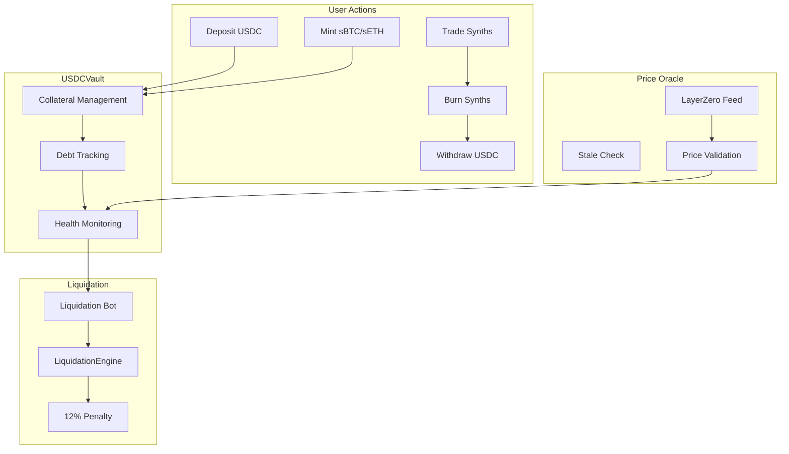
```mermaid
graph TB
    subgraph "User Actions"
        U1[Deposit USDC]
        U2[Mint sBTC/sETH]
        U3[Trade Synths]
        U4[Burn Synths]
        U5[Withdraw USDC]
    end
    
    subgraph "USDCVault"
        VAULT[Collateral Management]
        DEBT[Debt Tracking]
        HEALTH[Health Monitoring]
    end
    
    subgraph "Price Oracle"
        LZ[LayerZero Feed]
        STALE[Stale Check]
        PRICE[Price Validation]
    end
    
    subgraph "Liquidation"
        BOT[Liquidation Bot]
        ENGINE[LiquidationEngine]
        PENALTY[12% Penalty]
    end
    
    U1 --> VAULT
    U2 --> VAULT
    VAULT --> DEBT
    DEBT --> HEALTH
    LZ --> PRICE
    PRICE --> HEALTH
    HEALTH --> BOT
    BOT --> ENGINE
    ENGINE --> PENALTY
    
    U3 --> U4
    U4 --> U5
```

### Collateral Ratio Calculations

```ascii
Synth Asset Parameters:
┌──────────┬─────────────┬─────────────┬─────────────┬─────────────┐
│ Asset    │ Min CR      │ Liq Penalty │ Mint Fee    │ Burn Fee    │
├──────────┼─────────────┼─────────────┼─────────────┼─────────────┤
│ sBTC     │ 150%        │ 12%         │ 15 bps      │ 8 bps       │
│ sETH     │ 150%        │ 12%         │ 15 bps      │ 8 bps       │
│ sSOL     │ 160%        │ 15%         │ 20 bps      │ 10 bps      │
│ sLINK    │ 170%        │ 18%         │ 25 bps      │ 12 bps      │
└──────────┴─────────────┴─────────────┴─────────────┴─────────────┘

Health Factor Calculation:
health_factor = (collateral_value_usd) / (debt_value_usd)

Liquidation Trigger:
if health_factor < min_collateral_ratio:
    liquidate_position()
```

### Synthetic Asset Lifecycle

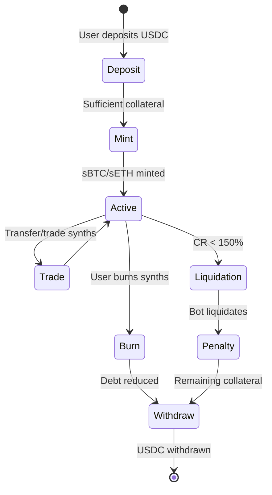
```mermaid
stateDiagram-v2
    [*] --> Deposit: User deposits USDC
    Deposit --> Mint: Sufficient collateral
    Mint --> Active: sBTC/sETH minted
    Active --> Trade: Transfer/trade synths
    Trade --> Active
    Active --> Burn: User burns synths
    Burn --> Withdraw: Debt reduced
    Withdraw --> [*]: USDC withdrawn
    
    Active --> Liquidation: CR < 150%
    Liquidation --> Penalty: Bot liquidates
    Penalty --> Withdraw: Remaining collateral
```

## Lend Protocol

### Permissionless Lending Architecture

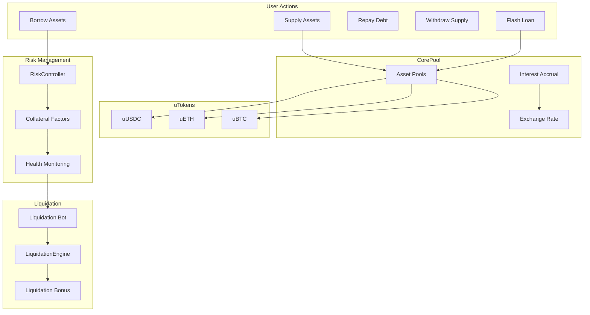
```mermaid
graph TB
    subgraph "User Actions"
        SUPPLY[Supply Assets]
        BORROW[Borrow Assets]
        REPAY[Repay Debt]
        WITHDRAW[Withdraw Supply]
        FLASH[Flash Loan]
    end
    
    subgraph "CorePool"
        POOL[Asset Pools]
        INTEREST[Interest Accrual]
        EXCHANGE[Exchange Rate]
    end
    
    subgraph "uTokens"
        USDC_U[uUSDC]
        ETH_U[uETH]
        BTC_U[uBTC]
    end
    
    subgraph "Risk Management"
        RISK[RiskController]
        FACTORS[Collateral Factors]
        HEALTH[Health Monitoring]
    end
    
    subgraph "Liquidation"
        LIQ_BOT[Liquidation Bot]
        LIQ_ENGINE[LiquidationEngine]
        BONUS[Liquidation Bonus]
    end
    
    SUPPLY --> POOL
    POOL --> USDC_U
    POOL --> ETH_U
    POOL --> BTC_U
    
    BORROW --> RISK
    RISK --> FACTORS
    FACTORS --> HEALTH
    
    HEALTH --> LIQ_BOT
    LIQ_BOT --> LIQ_ENGINE
    LIQ_ENGINE --> BONUS
    
    FLASH --> POOL
    INTEREST --> EXCHANGE
```

### Interest Rate Models

```ascii
Interest Rate Curve (Piecewise Linear):

     Borrow Rate (APY)
           │
       300%│                     ╱
           │                   ╱
           │                 ╱
       100%│               ╱
           │             ╱
        50%│           ╱
           │         ╱
        10%│       ╱
           │     ╱
         2%│───╱────────────────────────── Utilization
           0%  20%  40%  60%  80%  100%
                         │
                      Kink Point
                      
Parameters by Asset:
┌──────────┬─────────┬─────────┬─────────┬─────────┬─────────┐
│ Asset    │ Base    │ Slope1  │ Slope2  │ Kink    │ Reserve │
├──────────┼─────────┼─────────┼─────────┼─────────┼─────────┤
│ USDC     │ 0%      │ 5%      │ 300%    │ 80%     │ 10%     │
│ WETH     │ 0.5%    │ 8%      │ 400%    │ 75%     │ 15%     │
│ sBTC     │ 1%      │ 10%     │ 500%    │ 70%     │ 20%     │
│ sETH     │ 1%      │ 10%     │ 500%    │ 70%     │ 20%     │
└──────────┴─────────┴─────────┴─────────┴─────────┴─────────┘
```

### Flash Loan Flow

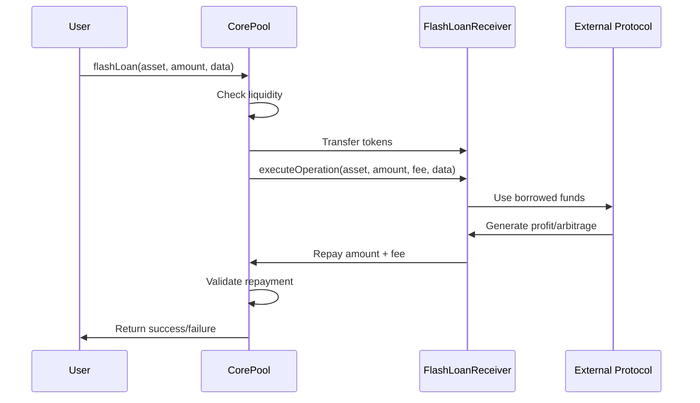
```mermaid
sequenceDiagram
    participant User
    participant CorePool
    participant Receiver as FlashLoanReceiver
    participant Protocol as External Protocol
    
    User->>CorePool: flashLoan(asset, amount, data)
    CorePool->>CorePool: Check liquidity
    CorePool->>Receiver: Transfer tokens
    CorePool->>Receiver: executeOperation(asset, amount, fee, data)
    
    Receiver->>Protocol: Use borrowed funds
    Protocol->>Receiver: Generate profit/arbitrage
    Receiver->>CorePool: Repay amount + fee
    
    CorePool->>CorePool: Validate repayment
    CorePool->>User: Return success/failure
```

## Perps Protocol

### Cross-Margin Perpetual Futures

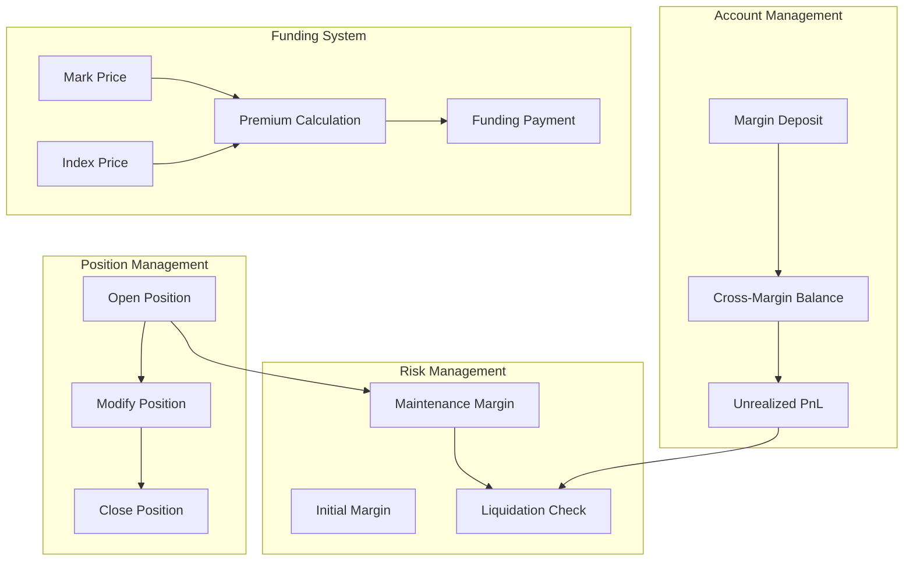
```mermaid
graph TB
    subgraph "Account Management"
        MARGIN[Margin Deposit]
        BALANCE[Cross-Margin Balance]
        PNL[Unrealized PnL]
    end
    
    subgraph "Position Management"
        OPEN[Open Position]
        MODIFY[Modify Position]
        CLOSE[Close Position]
    end
    
    subgraph "Funding System"
        MARK[Mark Price]
        INDEX[Index Price]
        PREMIUM[Premium Calculation]
        FUNDING[Funding Payment]
    end
    
    subgraph "Risk Management"
        MAINT[Maintenance Margin]
        INITIAL[Initial Margin]
        LIQ[Liquidation Check]
    end
    
    MARGIN --> BALANCE
    BALANCE --> PNL
    
    OPEN --> MODIFY
    MODIFY --> CLOSE
    OPEN --> MAINT
    
    MARK --> PREMIUM
    INDEX --> PREMIUM
    PREMIUM --> FUNDING
    
    MAINT --> LIQ
    PNL --> LIQ
```

### Funding Rate Mechanism

```ascii
Funding Rate Calculation:

Premium = (Mark Price - Index Price) / Index Price

Funding Rate = Premium * (1 hour / 24 hours)
             = Premium / 24

Capped at ±0.75% per hour

Example:
BTC Mark Price:  $50,000
BTC Index Price: $49,500
Premium = (50000 - 49500) / 49500 = 1.01%
Funding Rate = 1.01% / 24 = 0.042% per hour

If Long Position: Pay 0.042% per hour
If Short Position: Receive 0.042% per hour

Position Limits:
┌──────────┬─────────────┬─────────────┬─────────────┬─────────────┐
│ Asset    │ Max Lev     │ Maint Margin│ Liq Penalty │ Min Size    │
├──────────┼─────────────┼─────────────┼─────────────┼─────────────┤
│ BTC-PERP │ 25x         │ 4%          │ 2.5%        │ $50         │
│ ETH-PERP │ 25x         │ 5%          │ 2.5%        │ $50         │
│ SOL-PERP │ 20x         │ 6%          │ 3%          │ $25         │
│ Alt-coins│ 10x         │ 10%         │ 5%          │ $25         │
└──────────┴─────────────┴─────────────┴─────────────┴─────────────┘
```

### Position Lifecycle

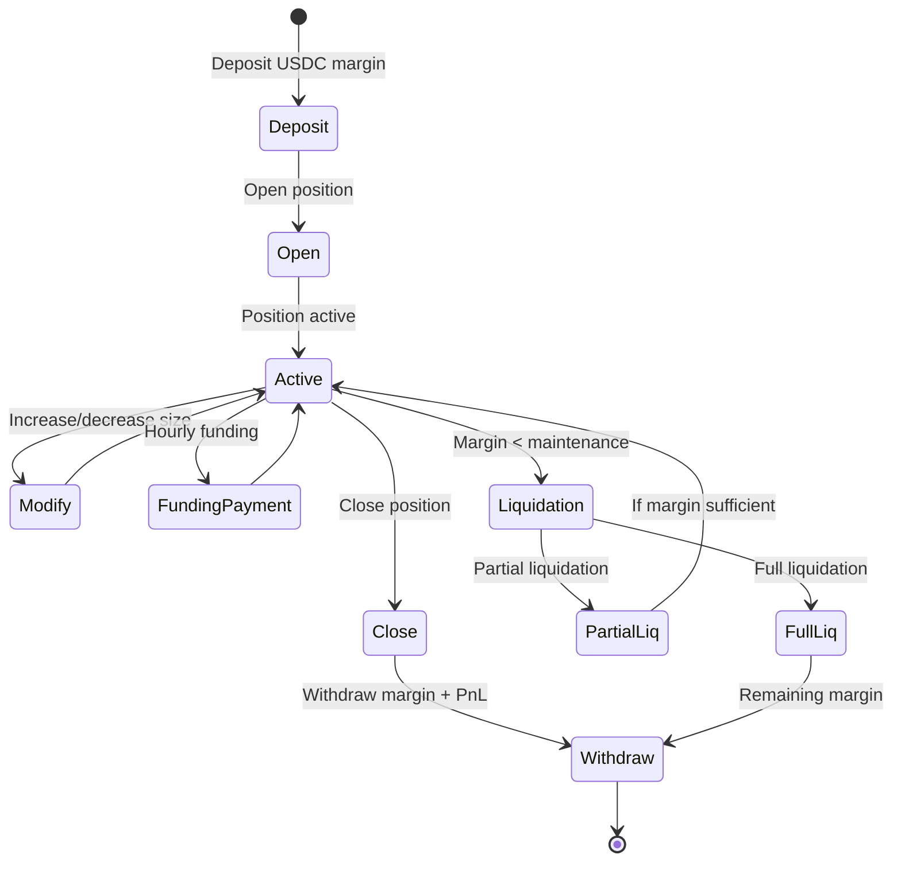
```mermaid
stateDiagram-v2
    [*] --> Deposit: Deposit USDC margin
    Deposit --> Open: Open position
    Open --> Active: Position active
    Active --> Modify: Increase/decrease size
    Modify --> Active
    Active --> FundingPayment: Hourly funding
    FundingPayment --> Active
    Active --> Close: Close position
    Close --> Withdraw: Withdraw margin + PnL
    Withdraw --> [*]
    
    Active --> Liquidation: Margin < maintenance
    Liquidation --> PartialLiq: Partial liquidation
    Liquidation --> FullLiq: Full liquidation
    PartialLiq --> Active: If margin sufficient
    FullLiq --> Withdraw: Remaining margin
```

## Options Protocol

### NFT-Based Options Trading

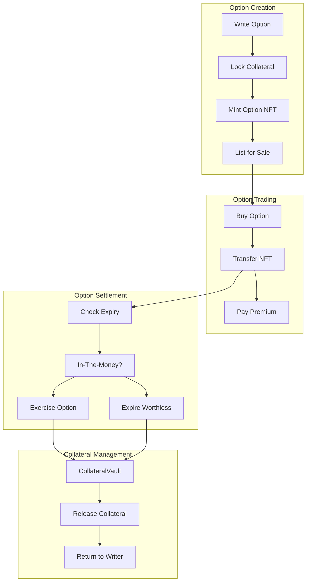
```mermaid
graph TB
    subgraph "Option Creation"
        WRITE[Write Option]
        COLLATERAL[Lock Collateral]
        MINT[Mint Option NFT]
        LIST[List for Sale]
    end
    
    subgraph "Option Trading"
        BUY[Buy Option]
        TRANSFER[Transfer NFT]
        PREMIUM[Pay Premium]
    end
    
    subgraph "Option Settlement"
        EXPIRY[Check Expiry]
        ITM[In-The-Money?]
        EXERCISE[Exercise Option]
        EXPIRE[Expire Worthless]
    end
    
    subgraph "Collateral Management"
        VAULT[CollateralVault]
        RELEASE[Release Collateral]
        RETURN[Return to Writer]
    end
    
    WRITE --> COLLATERAL
    COLLATERAL --> MINT
    MINT --> LIST
    
    LIST --> BUY
    BUY --> TRANSFER
    TRANSFER --> PREMIUM
    
    TRANSFER --> EXPIRY
    EXPIRY --> ITM
    ITM --> EXERCISE
    ITM --> EXPIRE
    
    EXERCISE --> VAULT
    EXPIRE --> VAULT
    VAULT --> RELEASE
    RELEASE --> RETURN
```

### Option Pricing & Collateral

```ascii
Option Types & Collateral Requirements:

Call Option (Right to BUY):
┌─────────────────────────────────────────────────────────┐
│ Writer locks: 1 unit of underlying asset (e.g., 1 ETH) │
│ Premium paid by buyer in quote asset (e.g., USDC)      │
│ Exercise: Buyer pays strike, receives underlying        │
└─────────────────────────────────────────────────────────┘

Put Option (Right to SELL):
┌─────────────────────────────────────────────────────────┐
│ Writer locks: Strike value in quote asset              │
│ Premium paid by buyer in quote asset                   │
│ Exercise: Buyer pays underlying, receives strike value │
└─────────────────────────────────────────────────────────┘

Example ETH Call Option:
• Underlying: ETH
• Strike: $3,000 USDC
• Expiry: 30 days
• Writer collateral: 1 ETH
• Premium: $150 USDC

If ETH > $3,000 at expiry:
• Buyer exercises, pays $3,000 USDC
• Buyer receives 1 ETH from collateral
• Writer keeps premium + strike payment

If ETH < $3,000 at expiry:
• Option expires worthless
• Writer receives back 1 ETH collateral
• Writer keeps premium
```

### Exercise & Settlement Flow

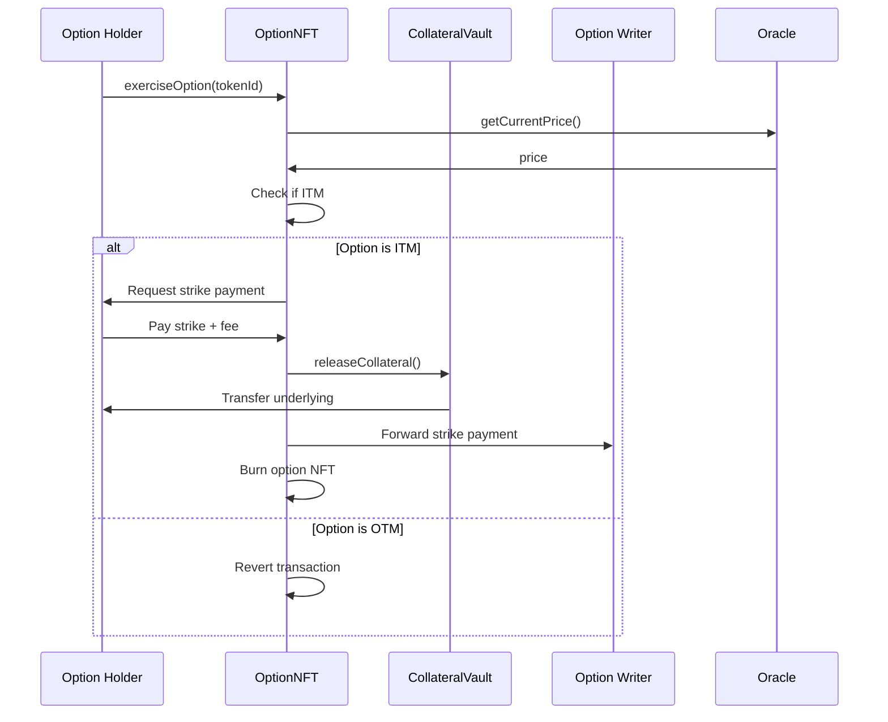
```mermaid
sequenceDiagram
    participant Holder as Option Holder
    participant OptionNFT
    participant Vault as CollateralVault
    participant Writer as Option Writer
    participant Oracle
    
    Holder->>OptionNFT: exerciseOption(tokenId)
    OptionNFT->>Oracle: getCurrentPrice()
    Oracle->>OptionNFT: price
    
    OptionNFT->>OptionNFT: Check if ITM
    alt Option is ITM
        OptionNFT->>Holder: Request strike payment
        Holder->>OptionNFT: Pay strike + fee
        OptionNFT->>Vault: releaseCollateral()
        Vault->>Holder: Transfer underlying
        OptionNFT->>Writer: Forward strike payment
        OptionNFT->>OptionNFT: Burn option NFT
    else Option is OTM
        OptionNFT->>OptionNFT: Revert transaction
    end
```

## DAO & Governance

### UNXV Tokenomics

```ascii
UNXV Token Distribution (1 Billion Total):

┌─────────────────────────────────────────────────────────────┐
│ Founders & Team (35% = 350M tokens)                        │
│ ████████████████████████████████████                       │
│ 4-year linear vest, 1-year cliff                           │
└─────────────────────────────────────────────────────────────┘

┌─────────────────────────────────────────────────────────────┐
│ Community Incentives (35% = 350M tokens)                   │
│ ████████████████████████████████████                       │
│ 6-year emissions, declining 1.4x every 12 months          │
└─────────────────────────────────────────────────────────────┘

┌──────────────────────────┐
│ Treasury (15% = 150M)    │
│ ████████████████         │
│ Immediate unlock         │
└──────────────────────────┘

┌─────────────────────┐
│ Ecosystem (8% = 80M)│
│ ████████████        │
│ 4-year linear vest  │
└─────────────────────┘

┌──────────────┐
│ Liquidity    │
│ (5% = 50M)   │
│ ████████     │
│ POL locked   │
└──────────────┘

┌────────────┐
│ Airdrop    │
│ (2% = 20M) │
│ ████       │
│ 12mo claim │
└────────────┘
```

### Voting Escrow Mechanism

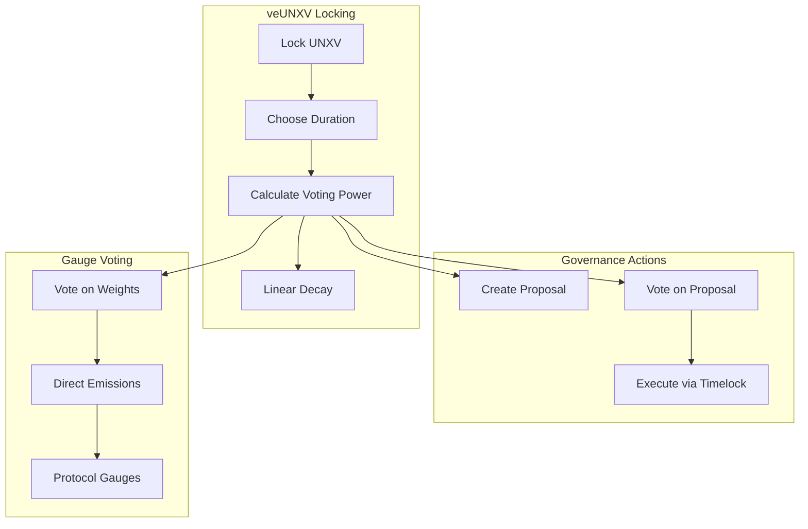
```mermaid
graph TB
    subgraph "veUNXV Locking"
        LOCK[Lock UNXV]
        DURATION[Choose Duration]
        VEPOWER[Calculate Voting Power]
        DECAY[Linear Decay]
    end
    
    subgraph "Governance Actions"
        PROPOSE[Create Proposal]
        VOTE[Vote on Proposal]
        EXECUTE[Execute via Timelock]
    end
    
    subgraph "Gauge Voting"
        GAUGES[Protocol Gauges]
        WEIGHTS[Vote on Weights]
        EMISSIONS[Direct Emissions]
    end
    
    LOCK --> DURATION
    DURATION --> VEPOWER
    VEPOWER --> DECAY
    
    VEPOWER --> PROPOSE
    VEPOWER --> VOTE
    VOTE --> EXECUTE
    
    VEPOWER --> WEIGHTS
    WEIGHTS --> EMISSIONS
    EMISSIONS --> GAUGES
```

### Gauge Emissions System

```ascii
Weekly Emissions Distribution:

Year 1: 80M UNXV tokens

Gauge Weights (Community Voted):
┌─────────────┬─────────────┬─────────────┬─────────────┐
│ DEX Gauge   │ Lend Gauge  │ Synth Gauge │ Perps Gauge │
│ 25%         │ 25%         │ 20%         │ 30%         │
│ 20M tokens  │ 20M tokens  │ 16M tokens  │ 24M tokens  │
└─────────────┴─────────────┴─────────────┴─────────────┘

Emissions flow to:
• Liquidity providers (DEX)
• Lenders and borrowers (Lend) 
• Synth minters and stakers
• Perps traders and LPs
• Protocol treasury (5% of all emissions)

veUNXV holders vote weekly on gauge weights
Minimum 1,000 veUNXV to propose new gauges
```

### Governance Process

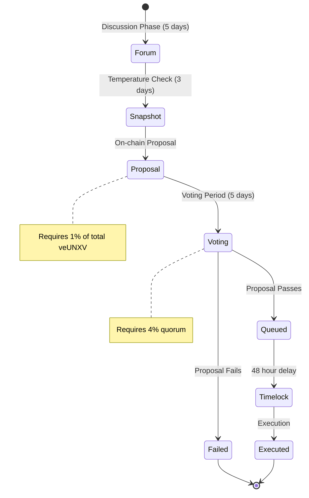
```mermaid
stateDiagram-v2
    [*] --> Forum: Discussion Phase (5 days)
    Forum --> Snapshot: Temperature Check (3 days)
    Snapshot --> Proposal: On-chain Proposal
    Proposal --> Voting: Voting Period (5 days)
    Voting --> Queued: Proposal Passes
    Voting --> Failed: Proposal Fails
    Queued --> Timelock: 48 hour delay
    Timelock --> Executed: Execution
    Failed --> [*]
    Executed --> [*]
    
    note right of Proposal: Requires 1% of total veUNXV
    note right of Voting: Requires 4% quorum
```

## Cross-Protocol Integration

### Unified Fee Collection

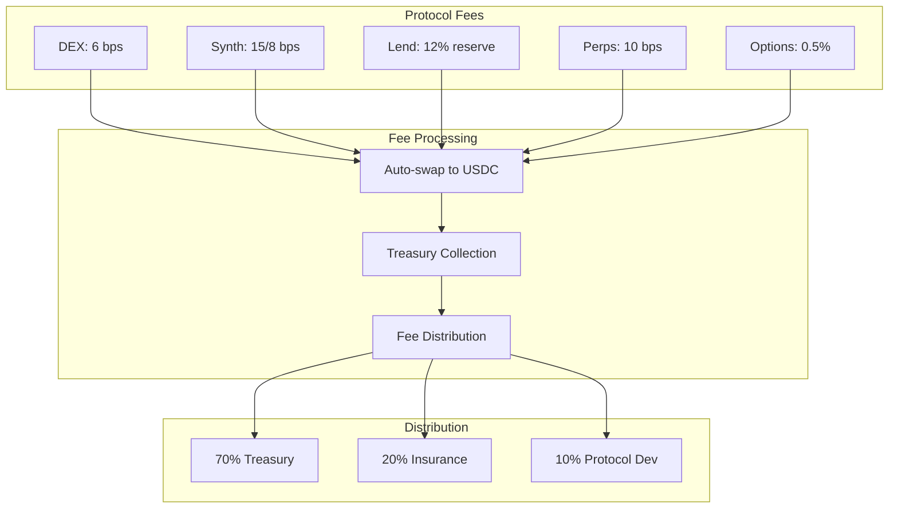
```mermaid
graph TB
    subgraph "Protocol Fees"
        DEX_FEE[DEX: 6 bps]
        SYNTH_FEE[Synth: 15/8 bps]
        LEND_FEE[Lend: 12% reserve]
        PERPS_FEE[Perps: 10 bps]
        OPTIONS_FEE[Options: 0.5%]
    end
    
    subgraph "Fee Processing"
        AUTOSWAP[Auto-swap to USDC]
        TREASURY[Treasury Collection]
        SPLIT[Fee Distribution]
    end
    
    subgraph "Distribution"
        TREASURY_SHARE[70% Treasury]
        INSURANCE_SHARE[20% Insurance]
        PROTOCOL_SHARE[10% Protocol Dev]
    end
    
    DEX_FEE --> AUTOSWAP
    SYNTH_FEE --> AUTOSWAP
    LEND_FEE --> AUTOSWAP
    PERPS_FEE --> AUTOSWAP
    OPTIONS_FEE --> AUTOSWAP
    
    AUTOSWAP --> TREASURY
    TREASURY --> SPLIT
    
    SPLIT --> TREASURY_SHARE
    SPLIT --> INSURANCE_SHARE
    SPLIT --> PROTOCOL_SHARE
```

### Liquidation Bot Integration

```ascii
Cross-Protocol Liquidation Network:

                    ╔══════════════════╗
                    ║  Liquidation Bot ║
                    ║     Network      ║
                    ╚════════┬═════════╝
                             │
          ┌──────────────────┼──────────────────┐
          │                  │                  │
    ╔═════▼═════╗      ╔═════▼═════╗      ╔═════▼═════╗
    ║   Synth   ║      ║   Lend    ║      ║   Perps   ║
    ║Liquidation║      ║Liquidation║      ║Liquidation║
    ║           ║      ║           ║      ║           ║
    ║ 12% bonus ║      ║ 10% bonus ║      ║ 2.5% fee  ║
    ╚═══════════╝      ╚═══════════╝      ╚═══════════╝
          │                  │                  │
          └──────────────────┼──────────────────┘
                             │
                    ╔════════▼═════════╗
                    ║   DEX for Swaps  ║
                    ║                  ║
                    ║ • Instant swaps  ║
                    ║ • Deep liquidity ║
                    ║ • MEV protection ║
                    ╚══════════════════╝

Bot Strategy:
1. Monitor all protocols for liquidatable positions
2. Calculate optimal liquidation amounts
3. Use flash loans from Lend protocol
4. Execute liquidations across protocols
5. Swap seized collateral on DEX
6. Repay flash loan + keep profit
```

## Example Scenarios

### Scenario 1: Arbitrage Across Protocols

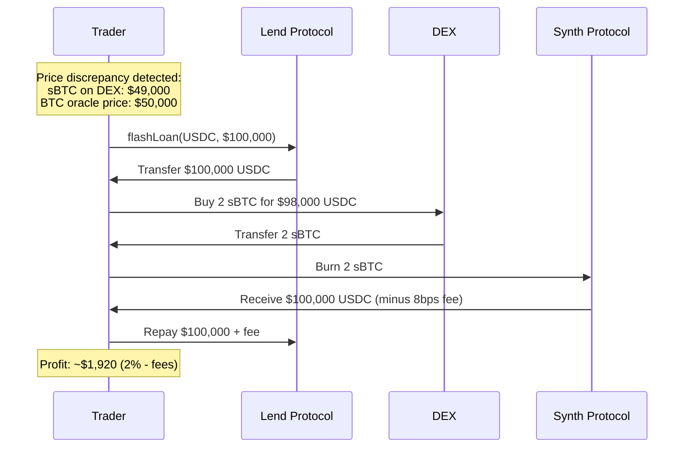
```mermaid
sequenceDiagram
    participant Trader
    participant Lend as Lend Protocol
    participant DEX
    participant Synth as Synth Protocol
    
    Note over Trader: Price discrepancy detected:<br/>sBTC on DEX: $49,000<br/>BTC oracle price: $50,000
    
    Trader->>Lend: flashLoan(USDC, $100,000)
    Lend->>Trader: Transfer $100,000 USDC
    
    Trader->>DEX: Buy 2 sBTC for $98,000 USDC
    DEX->>Trader: Transfer 2 sBTC
    
    Trader->>Synth: Burn 2 sBTC
    Synth->>Trader: Receive $100,000 USDC (minus 8bps fee)
    
    Trader->>Lend: Repay $100,000 + fee
    
    Note over Trader: Profit: ~$1,920 (2% - fees)
```

### Scenario 2: Delta-Neutral Strategy

```ascii
Delta-Neutral Strategy Example:

User has 10 ETH, wants to earn yield without price exposure

Step 1: Supply ETH to Lend Protocol
┌─────────────────────────────────────────────────────────┐
│ Supply: 10 ETH                                          │
│ Receive: 10 uETH (earning 3% APY)                      │
│ Can borrow: 7 ETH worth of assets (70% collateral)     │
└─────────────────────────────────────────────────────────┘

Step 2: Borrow USDC and Mint sETH
┌─────────────────────────────────────────────────────────┐
│ Borrow: $21,000 USDC (7 ETH worth)                     │
│ Mint: 7 sETH using USDC as collateral                  │
│ Cost: 15 bps mint fee                                  │
└─────────────────────────────────────────────────────────┘

Step 3: Short ETH via Perps
┌─────────────────────────────────────────────────────────┐
│ Use sETH as margin: 7 sETH                             │
│ Short ETH perps: 7 ETH notional at 1x leverage         │
│ Funding: Receive funding if shorts pay longs           │
└─────────────────────────────────────────────────────────┘

Net Position:
• Long 10 ETH (physical)
• Short 7 ETH (synthetic via sETH)  
• Short 7 ETH (perps)
• Net: -4 ETH exposure + yield from all protocols

Expected Returns:
• Lend supply: +3% APY on 10 ETH
• Borrow cost: -5% APY on $21,000 USDC
• Funding payments: Variable (could be positive)
• Protocol rewards: UNXV tokens from gauges
```

### Scenario 3: Options Market Making

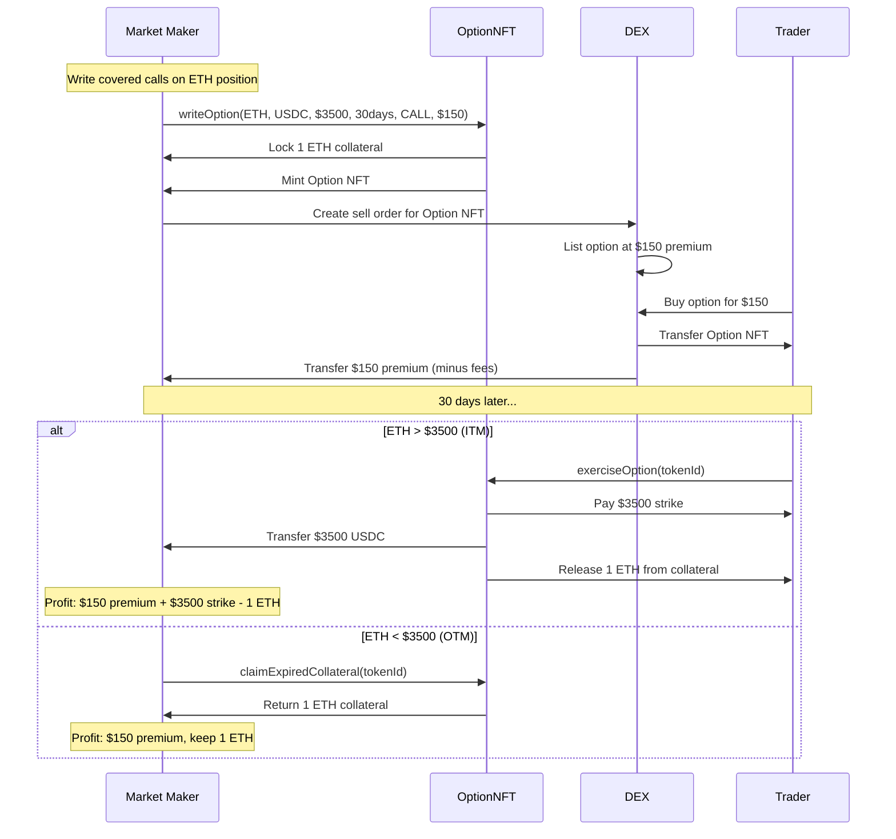
```mermaid
sequenceDiagram
    participant MM as Market Maker
    participant Options as OptionNFT
    participant DEX
    participant Trader
    
    Note over MM: Write covered calls on ETH position
    
    MM->>Options: writeOption(ETH, USDC, $3500, 30days, CALL, $150)
    Options->>MM: Lock 1 ETH collateral
    Options->>MM: Mint Option NFT
    
    MM->>DEX: Create sell order for Option NFT
    DEX->>DEX: List option at $150 premium
    
    Trader->>DEX: Buy option for $150
    DEX->>Trader: Transfer Option NFT
    DEX->>MM: Transfer $150 premium (minus fees)
    
    Note over Trader,MM: 30 days later...
    
    alt ETH > $3500 (ITM)
        Trader->>Options: exerciseOption(tokenId)
        Options->>Trader: Pay $3500 strike
        Options->>MM: Transfer $3500 USDC
        Options->>Trader: Release 1 ETH from collateral
        Note over MM: Profit: $150 premium + $3500 strike - 1 ETH
    else ETH < $3500 (OTM)
        MM->>Options: claimExpiredCollateral(tokenId)
        Options->>MM: Return 1 ETH collateral
        Note over MM: Profit: $150 premium, keep 1 ETH
    end
```

### Scenario 4: DAO Governance Action

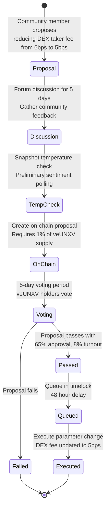
```mermaid
stateDiagram-v2
    [*] --> Proposal: Community member proposes<br/>reducing DEX taker fee from 6bps to 5bps
    
    Proposal --> Discussion: Forum discussion for 5 days<br/>Gather community feedback
    
    Discussion --> TempCheck: Snapshot temperature check<br/>Preliminary sentiment polling
    
    TempCheck --> OnChain: Create on-chain proposal<br/>Requires 1% of veUNXV supply
    
    OnChain --> Voting: 5-day voting period<br/>veUNXV holders vote
    
    Voting --> Passed: Proposal passes with<br/>65% approval, 8% turnout
    
    Voting --> Failed: Proposal fails
    
    Passed --> Queued: Queue in timelock<br/>48 hour delay
    
    Queued --> Executed: Execute parameter change<br/>DEX fee updated to 5bps
    
    Failed --> [*]
    Executed --> [*]
```

## Fee Structure

### Comprehensive Fee Grid

```ascii
┌─────────────┬─────────────────┬─────────────┬────────────────────────────────┐
│ Protocol    │ Action          │ Fee Rate    │ Distribution                   │
├─────────────┼─────────────────┼─────────────┼────────────────────────────────┤
│ DEX         │ Taker trade     │ 6 bps       │ 60% relayer, 30% treasury,    │
│             │                 │             │ 10% UNXV buyback              │
│             │ Maker rebate    │ -2 bps      │ Paid from taker fee            │
│             │ Order creation  │ 0.2 USDC    │ 100% treasury (gas coverage)   │
├─────────────┼─────────────────┼─────────────┼────────────────────────────────┤
│ Synth       │ Mint            │ 15 bps      │ 70% oracle vault,             │
│             │                 │             │ 30% surplus buffer            │
│             │ Burn            │ 8 bps       │ 100% surplus buffer           │
│             │ Liquidation     │ 12%         │ 50% liquidator, 30% surplus,  │
│             │                 │             │ 20% treasury                  │
├─────────────┼─────────────────┼─────────────┼────────────────────────────────┤
│ Lend        │ Reserve factor  │ 12%         │ 100% treasury                 │
│             │ Flash loan      │ 8 bps       │ 80% treasury, 20% rebate pool │
│             │ Liquidation     │ 10%         │ 60% liquidator, 25% insurance,│
│             │                 │             │ 15% treasury                  │
├─────────────┼─────────────────┼─────────────┼────────────────────────────────┤
│ Perps       │ Trade           │ 10 bps      │ 70% insurance, 20% treasury,  │
│             │                 │             │ 10% maker rebate              │
│             │ Funding skim    │ 10-15%      │ 100% insurance fund           │
│             │ Liquidation     │ 2.9%        │ 70% liquidator,               │
│             │                 │             │ 30% insurance                 │
├─────────────┼─────────────────┼─────────────┼────────────────────────────────┤
│ Options     │ Premium         │ 0.25%       │ 70% treasury, 20% insurance,  │
│             │                 │             │ 10% protocol dev              │
│             │ Exercise        │ 0.5%        │ 100% treasury                 │
└─────────────┴─────────────────┴─────────────┴────────────────────────────────┘

All fees auto-converted to USDC for simplified accounting
Insurance funds lend excess to treasury when above 5% of TVL target
Treasury performs quarterly buy-backs of UNXV with excess fees
```

## Security & Risk Management

### Multi-Layer Security Model


```mermaid
graph TB
    subgraph "Smart Contract Security"
        AUDIT[Professional Audits]
        FORMAL[Formal Verification]
        FUZZ[Fuzzing Tests]
        IMMUTABLE[Immutable Core Logic]
    end
    
    subgraph "Economic Security"
        INSURANCE[Insurance Funds]
        LIQUIDATION[Liquidation Incentives]
        COLLATERAL[Over-Collateralization]
        LIMITS[Position Limits]
    end
    
    subgraph "Operational Security"
        TIMELOCK[48h Timelock]
        MULTISIG[Guardian Multisig]
        PAUSE[Emergency Pause]
        MONITORING[24/7 Monitoring]
    end
    
    subgraph "Oracle Security"
        LAYERZERO[LayerZero Verification]
        STALENESS[Stale Price Checks]
        FALLBACK[Fallback Mechanisms]
        VALIDATION[Price Validation]
    end
    
    AUDIT --> FORMAL
    FORMAL --> FUZZ
    FUZZ --> IMMUTABLE
    
    INSURANCE --> LIQUIDATION
    LIQUIDATION --> COLLATERAL
    COLLATERAL --> LIMITS
    
    TIMELOCK --> MULTISIG
    MULTISIG --> PAUSE
    PAUSE --> MONITORING
    
    LAYERZERO --> STALENESS
    STALENESS --> FALLBACK
    FALLBACK --> VALIDATION
```

### Risk Parameters by Protocol

```ascii
Synth Protocol Risk Management:
┌─────────────────────────────────────────────────────────────┐
│ • Minimum 150% collateral ratio                            │
│ • 30-minute oracle staleness tolerance                     │
│ • 12% liquidation penalty incentivizes bots               │
│ • $5M insurance fund for edge cases                       │
│ • Governance can pause minting in emergencies             │
└─────────────────────────────────────────────────────────────┘

Lend Protocol Risk Management:
┌─────────────────────────────────────────────────────────────┐
│ • Conservative 65% max collateral factors                  │
│ • Dynamic interest rates prevent liquidity crises         │
│ • Flash loan fees prevent economic attacks                │
│ • $3M insurance fund covers bad debt                      │
│ • 24h timelock for parameter changes                      │
└─────────────────────────────────────────────────────────────┘

Perps Protocol Risk Management:
┌─────────────────────────────────────────────────────────────┐
│ • Maximum 25x leverage with 4% maintenance margin         │
│ • $10M max position size per market                       │
│ • Dynamic funding rates prevent manipulation              │
│ • $7M insurance fund covers negative PnL                  │
│ • Circuit breakers for extreme price movements            │
└─────────────────────────────────────────────────────────────┘

Options Protocol Risk Management:
┌─────────────────────────────────────────────────────────────┐
│ • Full collateralization for all written options          │
│ • Maximum 365-day expiry limits tail risk                 │
│ • Oracle-based automatic exercise prevents gaming        │
│ • $2M insurance fund for edge case scenarios             │
│ • Emergency pause for oracle failures                     │
└─────────────────────────────────────────────────────────────┘
```

### Emergency Procedures

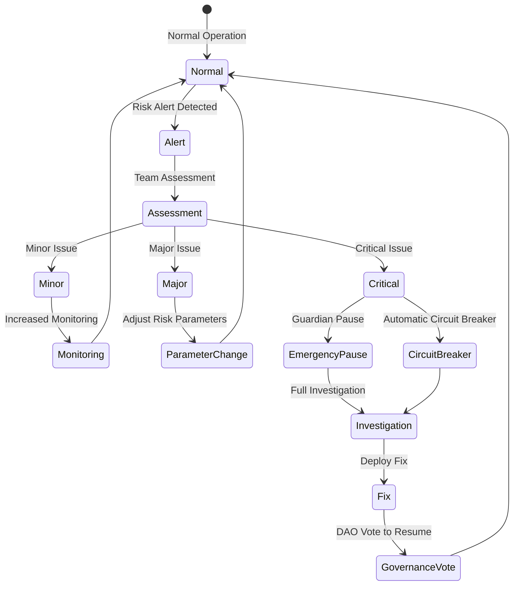
```mermaid
stateDiagram-v2
    [*] --> Normal: Normal Operation
    Normal --> Alert: Risk Alert Detected
    Alert --> Assessment: Team Assessment
    
    Assessment --> Minor: Minor Issue
    Assessment --> Major: Major Issue
    Assessment --> Critical: Critical Issue
    
    Minor --> Monitoring: Increased Monitoring
    Monitoring --> Normal
    
    Major --> ParameterChange: Adjust Risk Parameters
    ParameterChange --> Normal
    
    Critical --> EmergencyPause: Guardian Pause
    EmergencyPause --> Investigation: Full Investigation
    Investigation --> Fix: Deploy Fix
    Fix --> GovernanceVote: DAO Vote to Resume
    GovernanceVote --> Normal
    
    Critical --> CircuitBreaker: Automatic Circuit Breaker
    CircuitBreaker --> Investigation
```

---

This comprehensive documentation provides a complete overview of the Unxversal Protocol suite, demonstrating how all components work together to create a robust, integrated DeFi ecosystem on Peaq EVM. The protocol is designed for composability, security, and community governance while maintaining competitive fee structures and innovative features across all product lines. 