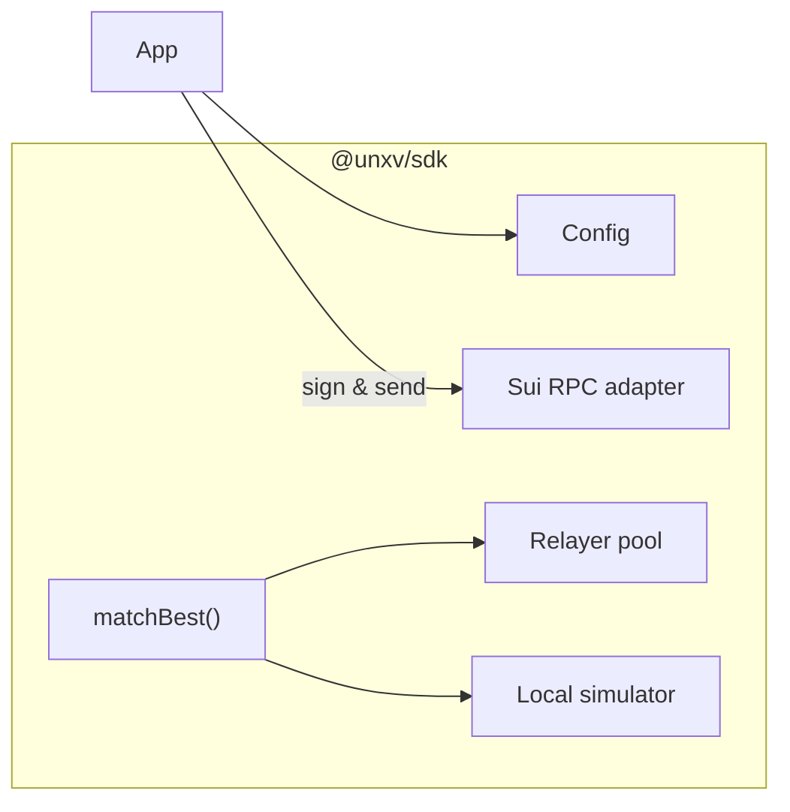

# unxversal dex — Spot trading on Sui’s native orderbook

A thin permissionless wrapper around **DeepBook** that adds UNXV-denominated fees, live indexer relays, and synth-aware token discovery—no custom matcher contract required.

---

## 0 · Why DeepBook?

* **Deterministic on-chain matching** – DeepBook batches and matches at the protocol level; unxversal inherits CEX-grade fairness without writing a single line of matcher logic.
* **Object-oriented fills** – each open order is an object; partial fills mutate the object, so gas ≈ `O(1)` per match.
* **Native composability** – perps, futures, and options reuse the same book for discovery; wallets only learn one API.

---

## 1 · High-level architecture

```mermaid
flowchart LR
    subgraph Off-chain
        RelayerPool["Relayer mesh\n(indexer + WS)"]
        SDK["@unxv/sdk"]
    end
    subgraph Sui
        DeepBook
        FeeSink["fee_sink::module"]
        Treasury
    end
    User["Trader / Bot"] --> SDK
    SDK -->|orderPlace / cancel| DeepBook
    DeepBook -->|FillEvent| RelayerPool
    DeepBook -->|taker_fee (asset)| FeeSink
    FeeSink -->|swap→UNXV| DeepBook
    FeeSink --> Treasury
```

1. **Maker** submits limit order through DeepBook directly.
2. **Taker** hits an order—DeepBook emits `FillEvent { maker, taker, assetIn, assetOut, feeAmount }`.
3. `fee_sink::on_fill()` auto-swaps `feeAmount` into **UNXV** via a same-block RFQ order routed to DeepBook and forwards the UNXV to `Treasury`.
4. **Relayer mesh** streams real-time fills and book delta snapshots to every client.

---

## 2 · Relayer mesh

| Component             | Responsibility                                                                                         | Protocols          |
| --------------------- | ------------------------------------------------------------------------------------------------------ | ------------------ |
| **Indexer**           | Replays all `NewOrder`, `Fill`, `Cancel` events from block-0 → tip; reconstructs L2 orderbook per pair | Sui RPC + fullnode |
| **WS broadcaster**    | Pushes `BookDelta` & `Ticker` JSON at sub-second frequency                                             | WebSocket          |
| **P2P gossip (opt.)** | Floods deltas to peer nodes for redundancy                                                             | libp2p (Gossipsub) |

*No auth, no API keys—anyone can spin up a relayer.*

---

## 3 · Fee mechanics

| Action               | Amount                   | Split (default)                           | Path to UNXV                                |
| -------------------- | ------------------------ | ----------------------------------------- | ------------------------------------------- |
| **Taker fill**       | 6 bps of filled notional | 60 % ➜ relayer addr \* <br>40 % ➜ FeeSink | FeeSink RFQs `fee_asset → UNXV` on DeepBook |
| **Maker**            | 0                        | —                                         | —                                           |
| **Cancel / partial** | 0                        | —                                         | —                                           |

\* If taker omits `relayer_addr`, 100 % of that slice routes to Treasury.

Governance can move each split ±10 % (48 h timelock).

---

## 4 · SDK flow



* **Auto-heal** – SDK races two relayers; falls back to on-chain log polling on failure.
* **Trust-but-verify** – before signing, `Sim` re-builds the transaction locally with current book to guarantee min-out.
* **Language ports** – TypeScript, Rust, Python.

---

## 5 · Market & synth listing

*`market_id = hash(assetA || assetB)`.*

1. If neither asset has a Pyth feed → UI warns but does **not** block listing.
2. Synths (`sBTC`, `sETH`, …) automatically appear once minted the first time; DeepBook pair is created lazily by the first order.
3. Token metadata pulled from on-chain registry → fallback to off-chain Git repo for logo/decimals.

---

## 6 · Security & MEV notes

| Risk                          | Mitigation                                                                                       |
| ----------------------------- | ------------------------------------------------------------------------------------------------ |
| **Front-running / sandwich**  | Users add `deadline` & `min_out`; bundle via Suiswap or Jito-style MEV-share.                    |
| **Relayer censorship / fork** | Multiple relayers + SDK on-chain verify.                                                         |
| **Fake tokens**               | UI default filter set = `{Pyth feed OR SynthFactory issued}`; but protocol stays permissionless. |
| **Fee swap slippage**         | `FeeSink` uses `TWAP_guard`: if RFQ swap > 1 % slippage vs. Pyth price → tx reverts.             |

---

## 7 · Gas & UX optimisations

* **Delegate approve via `coin::allow_delegation()`** – maker needn’t re-approve per order.
* **Batch actions** – `DeepBook::batch([...])` place/cancel multiple orders in one call.
* **Compressed events** – Relayer packs deltas with `lz4` over WS for mobile clients.

---

## 8 · Future extensions

| Idea                      | Description                                                                          |
| ------------------------- | ------------------------------------------------------------------------------------ |
| **RFQ meta-orders**       | Off-chain signed blobs that settle through `fill_by_sig()`, skipping mempool.        |
| **Cross-chain liquidity** | Wormhole broadcaster streams DeepBook mid/ask to other chains for mirrored books.    |
| **On-chain TWAP oracle**  | Use rolling VWAP from DeepBook as fallback for synth & perps if Pyth latency spikes. |

---

## 9 · TL;DR

* unxversal doesn’t re-invent an orderbook—it **mounts** DeepBook and bolts on UNXV fee capture.
* Relayer mesh keeps UX real-time; SDK sim-checks every fill.
* Fees auto-swap to UNXV inside the same block, sustaining the value loop.
* Synths trade natively day-1; any new Pyth feed is one governance flip away from a full stack of spot, perps, futures, and options.

