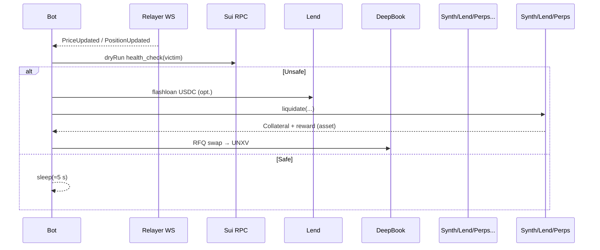

# liquidationbots.md — First-responders that keep **unxversal** solvent on Sui

Liquidation bots **still matter**—even with DeepBook matching and cross-margin.
Whenever a trader, borrower or minter drops below the minimum safety ratio, bots:

1. **Detect** the at-risk account seconds after a Pyth price tick.
2. **Bundle** a transaction that repays (or force-closes) the position.
3. **Collect** a slice of the liquidation penalty—paid in the seized asset, immediately swapped to **UNXV** for them by protocol logic.

Because the protocol never auto-chops positions on its own, an open, permissionless bot market is the cheapest and most resilient way to guarantee solvency.

---

## 1 · Coverage grid

| Protocol             | Trigger           | Bot action                                                  | Reward (after swap → UNXV)               |
| -------------------- | ----------------- | ----------------------------------------------------------- | ---------------------------------------- |
| **Synth**            | CR < 160 %        | `synth::liquidation::liquidate(account, synthId, repay)`    | **50 %** of 12 % penalty (= 6 % of debt) |
| **Lend**             | Health < 1        | `lend::liquidation::liquidate(borrower, asset, maxRepay)`   | **60 %** of 10 % penalty (= 6 % of debt) |
| **Perps**            | Health < 1        | `perps::liquidation::liquidate(trader, marketId, notional)` | **70 %** of 1.5–2.5 % penalty            |
| **Futures**          | Health < 1        | `futures::liquidation::liquidate(...)`                      | **70 %** of 1 % penalty                  |
| **Options** (writer) | Collateral < req. | `options::clearing::liquidate_writer(...)`                  | **80 %** of 2–4 % penalty                |

All other penalty slices route to the relevant insurance fund and Treasury automatically.

---

## 2 · End-to-end bot workflow



### Key points

* **dryRun** – Sui `dev_inspect_transaction` returns health metrics without risk.
* **Flash-borrow** – One call pulls USDC from Lend, repays victim, then repays flash plus fee.
* **Atomic RFQ** – Bot can embed a DeepBook RFQ inside the same TX for instant hedge or UNXV swap.

---

## 3 · Economic incentives (Year-1 assumptions)

| Variable             | Typical value | Notes                           |
| -------------------- | ------------- | ------------------------------- |
| Synth debt repaid    | \$100 000     | Mid-size vault                  |
| Gross penalty (12 %) | \$12 000      |                                 |
| Bot share (50 %)     | \$ 6 000      | Receives in USDC, swaps to UNXV |
| Gas (Sui)            | < \$0.02      | Sub-second finality             |
| Oracle drift risk    | \~\$150       | One block latency               |
| **Expected net PnL** | **\~\$5 850** | Extremely attractive vs. risk   |

Even after fee decay, low Sui gas keeps liquidation ROI high, guaranteeing plenty of competing bots.

---

## 4 · Quick-start template (Rust)

```rust
// cargo add sui-sdk

let client = SuiClient::new(rpc_url)?;
let relayer = WsSub::new(ws_url, event_filters);

loop {
    if let Some(alert) = relayer.next_risky_position()? {
        if client.simulate_liquidation(&alert).is_ok() {
            let tx = build_bundle(&alert, &config)?;
            client.sign_and_send(tx)?;
        }
    }
}
```

*The SDK helper `simulate_liquidation` wraps `dev_inspect_transaction` so the bot only spends gas when success is deterministic.*

---

## 5 · Best-practice checklist

| Area            | Rule                                                                             |
| --------------- | -------------------------------------------------------------------------------- |
| **Gas bidding** | Under normal load, default gas price suffices; bump only on high-vol vols.       |
| **Concurrency** | Run parallel workers per protocol to avoid missing cross-asset cascades.         |
| **Capital**     | Hold both USDC & UNXV; but rely on flash-loans + DeepBook RFQ to minimise idle.  |
| **Rate limits** | Respect Sui full-node request caps or self-host a node for industrial bots.      |
| **Monitoring**  | Track penalty PnL vs. Pyth oracle lag—exit if spreads compress below gas + risk. |

---

## 6 · Why bots, not protocol-owned keepers?

* **Competitive bid → lowest necessary penalty** – multiple bots race to close *just enough* debt.
* **Censorship-resistant** – no single keeper can grief the protocol.
* **Composable liquidity** – bots freely arbitrage DeepBook and external CEXs, tightening price.
* **Self-funded** – reward comes from positions themselves; DAO does not subsidise operations.

---

## 7 · Governance levers

| Lever                  | Fast-path                               | Timelock-path              |
| ---------------------- | --------------------------------------- | -------------------------- |
| **Lower** penalties    | Guardian (instant)                      | —                          |
| **Raise** penalties    | —                                       | Governor vote + 48 h delay |
| **Change closeFactor** | Guardian lower-only                     | Governor raise             |
| **Top-up insurance**   | Treasury multisig (ratified next epoch) |                            |

The DAO can always throttle bot profitability down—but never secretly raise it without community notice.

---

## 8 · TL;DR

Yes—liquidation bots are alive and well.
They monitor Pyth ticks & position events, flash-borrow from **Lend**, hedge on **DeepBook**, and leave every protocol fully solvent within one block—all while buying a healthy chunk of **UNXV** on each rescue.
