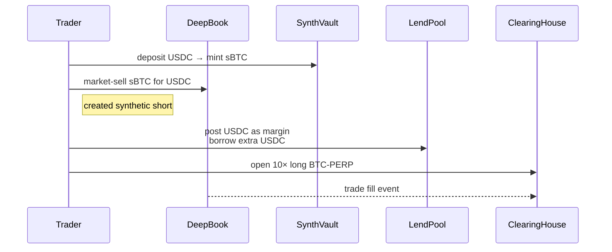

# unxversal on **Sui** – everything, everywhere, all in UNXV

A modular DeFi operating system that plugs straight into **DeepBook** for on-chain order-matching, settles every fee in **UNXV**, and lets any supported **Pyth** price feed spin up a USD-backed synthetic asset usable across the entire stack.

---

## 1 · Core mission

> **Trade, borrow, hedge and speculate on any Pyth-priced asset – all from one margin pool, with one fee token, under one transparent DAO.**

---

## 2 · Why Sui + DeepBook?

| Feature                            | Sui / DeepBook                                         | What it unlocks for unxversal                                                                      |
| ---------------------------------- | ------------------------------------------------------ | -------------------------------------------------------------------------------------------------- |
| **Object-oriented Move**           | Granular, per-object ownership & zero gas on failed Tx | Gas-efficient margin & liquidation flows                                                           |
| **Native orderbook (DeepBook)**    | Deterministic, on-chain matching engine                | Spot, perps, dated futures & options can share liquidity without building custom matcher contracts |
| **Pyth mainnet feeds**             | 400+ low-latency price oracles                         | USDC synths for every listed ticker + robust mark/funding prices                                   |
| **High tps / sub-second finality** | 10K + TPS, \~450 ms                                    | CEX-like UX for web & mobile traders                                                               |

---

## 3 · Fee flywheel (all roads lead to UNXV)

1. **Every taker fill, borrow interest, mint, trade or liquidation penalty is charged in the *transacting asset***, then immediately market-swapped into **UNXV** through DeepBook.
2. **Treasury** receives UNXV and either

   * **burns** it, or
   * **ve-locks** it for meta-yield, as decided by weekly DAO vote.
3. **ve-lockers** (4-year max) earn protocol distributions and weight gauges that steer UNXV emissions to the products they care about.

Result: demand for block-space → demand for UNXV on every transaction path.

---

## 4 · Product matrix (all synth-aware)

| Pillar            | DeepBook flow           | Margin / Collateral              | Key fee hooks (→ UNXV)     | Synth utility                                               |
| ----------------- | ----------------------- | -------------------------------- | -------------------------- | ----------------------------------------------------------- |
| **Spot DEX**      | Native DeepBook markets | Fully backed in-wallet           | 6 bps taker                | Trade sBTC, sETH, etc. 1:1 like real coins                  |
| **Lending**       | n/a (uCoin receipts)    | Cross-asset (USDC, UNXV, synths) | 12 % reserve on interest   | Borrow synths to short, lever or LP                         |
| **Synths**        | Mint / burn in Move     | USDC vault (150 % min CR)        | 15 bps mint, 8 bps burn    | Underpins perps & options pricing                           |
| **Perps**         | Fill orders on DeepBook | Shared cross-margin USDC/UNXV    | 10 bps taker; funding skim | sAssets listed as underliers day-1                          |
| **Dated futures** | DeepBook orderbook      | Same margin account              | 5 bps open/close           | Cash-settle into synth at expiry                            |
| **Options**       | Orderbook / RFQ         | Portfolio-margin engine          | 15 bps premium fee         | Cash-settle into synth at expiry or delta-hedge with synths |

*Every column consumes & recycles synths, so Pyth coverage = protocol coverage.*

---

## 5 · Cross-protocol flow in one block

*One UX → three contracts → all fees auto-convert to UNXV in the background.*

---

## 6 · Governance skeleton

* **UNXV (Sui Move coin)** – 1 B hard cap, EIP-2612-style permit.
* **ve-UNXV** – 1- to 4-year linear decay; voting checkpoints in Move resource.
* **Governor** – Open-zep Bravo logic port; `proposalThreshold = 1 %`, `quorum = 4 %`.
* **Timelock** – 48 h delay on all privileged calls.
* **Pause Guardian** – 3-of-5 multisig, revoke-able after year 1.

---

## 7 · Launch roadmap (Sui)

| Phase                   | Milestones                                                                                                                   |
| ----------------------- | ---------------------------------------------------------------------------------------------------------------------------- |
| **Alpha (Testnet)**     | • Deploy token, ve, DAO core • Spot DEX markets (BTC/USDC, ETH/USDC, sBTC/USDC) • Synth vault with 20 top Pyth feeds |
| **Beta (Mainnet soft)** | • Lend pool (USDC/UNXV/sUSD) • Perps on BTC & ETH • Protocol fees live → UNXV buy-lock                               |
| **Full Mainnet**        | • Dated futures + options • 400+ synths live (all Pyth feeds) • Treasury UNXV burn schedule on-chain                 |
| **Expansion**           | • Cross-chain UNXV bridge (Wormhole)  • zkLogin wallets / mobile UX  • Permissionless market listing DAO app         |

---

## 8 · TL;DR

* **Everything fees → UNXV**, everything prices → **Pyth**, everything matching → **DeepBook**.
* Synths are first-class citizens across spot, leverage, futures & options.
* One DAO, one margin pool, one transparent audit trail – built the Sui-native way.